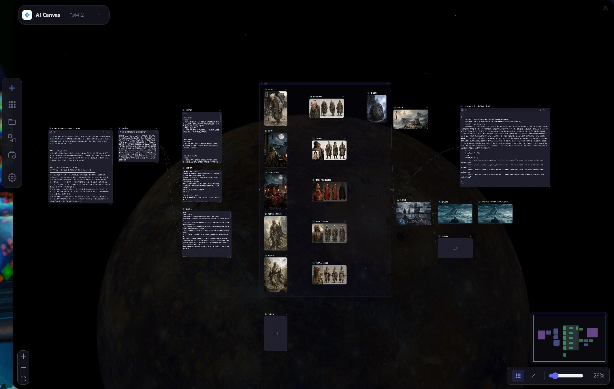

# AI Canvas Tauri

> 基于 **Tauri 2 + React 19 + React Flow** 的 AI 多模态节点画布编辑器。

AI Canvas Tauri 将文本、图像、视频、音频、Markdown、360° 全景和 ComfyUI 工作流组织成可视化节点。你可以在一块无限画布上自由编排生成链路，把云端模型、本地模型和本地文件管理放在同一个桌面应用里。


## Screenshot



## License

本项目采用 **AI Canvas Tauri Source-Available License**。

允许学习、研究、内部使用、修改和集成使用。禁止未经授权的套壳销售、白标分发、源码转售、商业再分发及将本项目作为同类产品进行商业化。

本项目并非 OSI 定义下的开源项目。如需商业授权，请联系版权方。

## Highlights

| 能力 | 说明 |
| --- | --- |
| 本地优先 | 项目文件、媒体资源、API 配置保存在用户本地目录，一个项目一个文件夹，便于迁移和归档。 |
| 双存储通道 | 桌面端通过 Tauri 原生文件系统读写；浏览器环境自动回退到 IndexedDB。 |
| 多模态节点 | 文本、图像、视频、音频、Markdown、360° 全景、源文件节点统一在画布中连接。 |
| 云端 + 本地 AI | 支持云端厂商、OpenAI 兼容接口、本地 ComfyUI 工作流。 |
| 画布生产力 | React Flow 无限画布、小地图、网格、吸附对齐、分组、撤销重做、复制粘贴。 |
| 轻量桌面端 | 基于 Tauri 2，使用系统 WebView 与 Rust 后端能力，体积更克制。 |

## Features

### 画布交互

- 无限画布：缩放、平移、小地图、网格背景和适应画布。
- 节点操作：拖拽、框选、多选、分组、复制、剪切、粘贴、删除。
- 智能对齐：拖拽节点时显示吸附辅助线。
- 历史记录：节点和连线操作支持撤销 / 重做。
- 系统剪贴板：支持图片、文件和文本内容直接粘贴到画布。

### AI 节点

- 文本生成：多轮对话、流式输出、提示词预设。
- 图像生成：文生图 / 图生图，支持抠图、标注、裁剪、自由视角等编辑能力。
- 视频生成：文生视频 / 图生视频。
- 音频生成：TTS 文本转语音与音频预览。
- Markdown：编辑 / 预览 / 全屏查看。
- 360° 全景：基于 Three.js 渲染，支持拖拽浏览和截图生成图片节点。
- `@` 引用：在提示词中引用其他节点的输出结果。
- ComfyUI 工作流：导入 JSON 后在画布中调用本地 ComfyUI 执行任务。

### 桌面体验

- macOS / Windows 自定义标题栏与窗口控制。
- 深色 / 浅色主题，多种画布背景。
- API Key、模型、ComfyUI、快捷键集中配置。
- 输出历史、资源面板和工作流面板辅助管理生成资产。

## Tech Stack

| 技术 | 用途 |
| --- | --- |
| [Tauri 2](https://tauri.app/) | 桌面应用壳、窗口管理、原生文件系统能力 |
| [React 19](https://react.dev/) | UI 渲染 |
| [React Flow](https://reactflow.dev/) | 节点画布 |
| [Zustand](https://zustand.docs.pmnd.rs/) | 全局状态管理 |
| [Tailwind CSS](https://tailwindcss.com/) | 样式系统 |
| [Three.js](https://threejs.org/) | 360° 全景渲染 |
| [@iconify/react](https://iconify.design/) | 图标体系 |
| [TypeScript](https://www.typescriptlang.org/) | 类型约束 |
| [framer-motion](https://www.framer.com/motion/) | 动效 |

## Quick Start

### 环境要求

- Node.js >= 18
- Rust stable toolchain
- npm

### 安装依赖

```bash
npm install
```

### 启动开发环境

```bash
# 仅启动 Web 前端
npm run dev

# 启动完整 Tauri 桌面应用
npm run tauri dev
```

### 构建

```bash
# 构建 Web 前端
npm run build

# 构建桌面应用
npm run tauri build
```

## Project Structure

```text
AI-Canvas-tauri/
├── src/
│   ├── components/       # React 组件：画布、节点、面板、标题栏、设置等
│   ├── hooks/            # 画布交互、快捷键、节点创建、右键菜单等 Hooks
│   ├── services/         # AI、文件系统、IndexedDB、上传与连接测试服务
│   ├── store/            # Zustand store 与各业务 slice
│   ├── styles/           # 按模块拆分的 CSS 与 React Flow 覆盖
│   ├── types/            # 全局类型定义
│   ├── utils/            # 通用工具函数
│   ├── App.tsx           # 根组件装配
│   └── main.tsx          # React 入口
├── src-tauri/
│   ├── src/              # Rust 后端入口、Tauri command、平台能力
│   ├── Cargo.toml        # Rust 依赖
│   └── tauri.conf.json   # Tauri 应用配置
├── doc/                  # 参考文档
├── package.json          # 前端依赖与 npm scripts
├── vite.config.ts        # Vite 配置
└── tailwind.config.js    # Tailwind token 与主题配置
```

## Core Modules

| 模块 | 说明 |
| --- | --- |
| `src/components/Canvas.tsx` | React Flow 画布主入口，装配节点、连线、右键菜单、小地图和工具栏。 |
| `src/components/nodes/` | 各类 AI 节点与源文件节点。 |
| `src/components/nodes/shared/` | 节点共享能力：提示词面板、模型选择、工具栏、上传、重命名等。 |
| `src/store/useAppStore.ts` | Zustand 主 store，组合节点、项目、配置、历史、UI、工作流等 slice。 |
| `src/services/fileService.ts` | Tauri 文件系统与浏览器 IndexedDB 的统一文件服务入口。 |
| `src/services/aiService.ts` | 多厂商 AI 生成与工作流调用的服务封装。 |
| `src-tauri/src/` | Tauri 2 后端能力、插件注册和平台相关逻辑。 |

## Development Notes

- 文件读写优先走 `fileService.ts`，避免在组件中直接分散调用 Tauri 文件 API。
- 画布状态统一通过 Zustand actions 修改，不在组件中直接改节点数组。
- 样式优先复用 Tailwind 与 `canvas-*` token，React Flow 覆盖集中在 `src/styles/reactflow.css`。
- 新增节点类型时，同时补充类型定义、节点组件、样式和 store 行为。
- 接入真实模型或工作流时，优先扩展 provider / workflow adapter，避免在节点组件中堆硬编码分支。

## Contact

开发沟通 QQ 群：873354155
