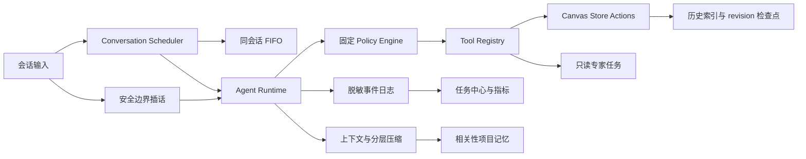

# Agent 运行时演进设计

> 状态：已确认，按方案 A 分阶段实施
> 日期：2026-07-21
> 分支：`codex/agent-runtime-evolution`
> 基线：`master@5304871`

## 1. 目标

在现有 Agent Runtime、Tool Registry、Policy Engine 和 IndexedDB v13 基础上，补齐长任务调度、恢复、回退、可观测性、上下文质量和受限专家协作能力。实现必须保持当前安全矩阵，不引入任意 Shell、通用 HTTP、可写子 Agent 或可扩大权限的 Skill。

## 2. 非目标

- 不重写 `ChatPanel`、Zustand Store 或现有工具体系。
- 不引入 npm/cargo 依赖，不修改 `tauri.conf.json` 或 Tauri capability。
- 不实现插件市场、外部 Hook 执行、MCP、ACP、定时器或通用后台命令。
- 不自动写入项目记忆，不让专家 Agent 调用画布写入或媒体生成。
- 不修改 `README.md`，不触碰原工作区未提交的样式改动。

## 3. 总体架构

核心原则：同一会话最多一个执行中的主任务；不同会话可并行，但画布写入继续由 revision 校验保护。新消息默认排队，用户可显式选择插入当前任务。插话只在模型轮次开始前或工具结果全部收齐后消费，绝不打断写工具。

## 4. 阶段 A：消息调度与插话

- 新建无 Store 依赖的会话调度器，以 `conversationId` 隔离 FIFO。
- 新任务仍通过现有 `AgentTask` 持久化；运行时队列不持久化，重启后既有恢复规则把未完成任务转为 `paused`。
- 主窗口和独立窗口共享 `dispatchMode` 协议。
- 活跃任务支持插话缓冲；不支持插话的本地降级管线自动回退为排队。
- 停止、删除会话和项目切换会清理对应运行时队列。

## 5. 阶段 B：恢复、回退、指标与任务中心

`AgentTask` 增加有上限的脱敏事件数组、任务指标、父任务关系和结果摘要。日志只保存事件类别、工具 ID、Policy 结果、token、耗时、错误码、revision 和历史索引，不保存提示词、工具正文、绝对路径、密钥或完整外部内容。

每个成功的 `canvas_write` 步骤记录执行前后的 `historyIndex` 与 revision。整体回退仅在以下条件全部满足时开放：当前项目匹配、当前历史索引等于任务最后检查点、任务检查点构成连续链、没有后续用户或其他任务写入。否则拒绝回退并给出稳定错误码。

恢复时把已完成步骤的脱敏摘要注入模型上下文，并使用工具 ID 与输入指纹阻止完全相同的成功写调用再次执行。全局任务中心展示当前项目的主任务和专家任务、状态、token、耗时和审批，并复用现有暂停、继续、停止和回退 Action。

## 6. 阶段 C：上下文、记忆、Skill 与规划模式

- 项目记忆使用本地相关性评分：关键词/中文 n-gram、类别权重、时间衰减和 MMR 去重；仍受 1500 token 预算约束。
- 压缩摘要改为固定结构，纳入活跃任务状态，校验节点 ID、模型引用、URL 等关键锚点，并保证覆盖游标单调递增。
- Skill 支持轻量 Manifest：`name`、`description`、`when-to-use`、`allowed-tools`、`user-invocable`、`disable-model-invocation`、`version`。Manifest 只允许缩小 Tool Registry 可见集合。
- Agent 模式增加 `plan`。该模式只暴露 `read` 工具；所有写入、媒体生成和记忆写入由 Policy 再次固定拒绝。

## 7. 阶段 D：生命周期与只读专家 Agent

新增进程内类型化生命周期总线，覆盖任务、模型轮次、Policy、工具、审批、压缩和专家任务事件。监听器异常隔离，不能影响 Runtime 或改变 Policy；本阶段不提供外部脚本和 HTTP 监听器。

只读专家以父任务下的独立 `AgentTask` 运行，使用单独模型上下文且 `tools: []`。首批角色为画布结构审阅、工作流风险审阅和资产复用审阅。输入只包含节点 ID、显示编号、类型、标签、状态和边关系，不包含绝对路径、密钥或未授权正文。嵌套深度固定为 1，每个父任务最多 3 个专家任务。

## 8. 数据兼容与回滚

- `AgentTask`、`ChatConversation`、`UserSkill` 新字段全部可选，旧记录读取时由 normalize 补默认值。
- 事件日志嵌入 `agentTasks`，本批不新增 object store，不提升 DB_VERSION。
- 每阶段单独提交；回滚时可移除入口和运行时装配，既有任务、消息和记忆仍可读取。
- `plan` 模式回滚时按 `collaborative` 读取，Skill Manifest 回滚时保留原始正文。
- 专家工具可通过 Registry 注销，不影响主 Agent 工具。

## 9. 验收

- 同会话连续发送不会并发执行两个主任务；不同会话仍可后台运行。
- 排队项可停止，插话按 FIFO 在安全边界进入当前任务。
- 重启恢复不会自动重放成功写工具；不安全的任务回退被拒绝。
- 指标和事件日志中不出现提示词、绝对路径或密钥。
- 记忆排序与输入主题相关，压缩摘要锚点不丢失。
- `plan` 模式无法获得写工具；Skill allowlist 不能扩大权限。
- 专家任务无工具、无嵌套、无画布副作用，结果只作为父任务 Observation。

