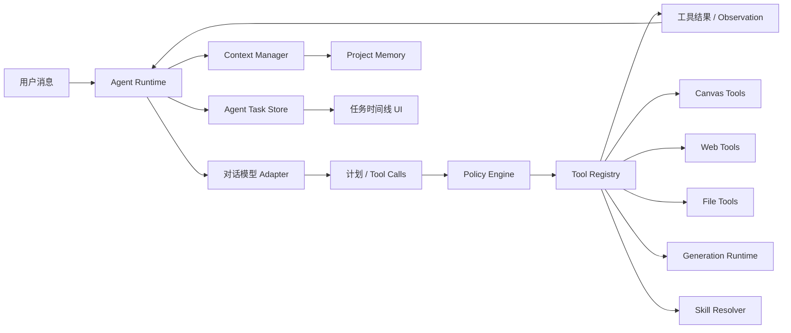

# 对话助手 Agent 能力实施方案

> 文档状态：P3、P4 阶段已完成；P5-A/P5-B/P5-D 已完成，P5-C 待实施
> 创建日期：2026-07-16
> 适用项目：AI Canvas Tauri
> 关联方案：`doc/对话式画布助手-功能方案.md`

## 1. 文档用途

本文档是对话助手 Agent 化改造的实施主线，用于：

- 固化已经确认的产品边界和架构决策；
- 按阶段管理实施范围、风险、验证和回滚；
- 记录每个阶段的真实完成日期、实际文件和检查结果；
- 防止在 `ChatPanel`、`assistantService` 或模型适配层继续堆叠临时分支；
- 保证每个阶段均可独立验证、暂停和回滚。

后续每开始或完成一个阶段，都必须同步更新本文档顶部进度表和对应阶段的完成记录。

### 1.1 状态标记

| 标记 | 含义 |
|---|---|
| `[ ]` | 未开始 |
| `[~]` | 进行中 |
| `[x]` | 已完成并通过阶段验收 |
| `[!]` | 阻塞，需要用户决策或外部条件 |
| `[-]` | 曾完成后按用户决定移除 |

### 1.2 阶段更新规则

1. 开始编码前，把对应阶段改为 `[~]`，填写开始日期和最终文件清单。
2. 实施中如改变范围，先在本文档记录原因、影响和回滚方式。
3. 只有代码、迁移、定向检查和阶段验收都完成后，才能标记为 `[x]`。
4. 完成记录必须填写实际执行过的命令，禁止记录未运行的检查。
5. 发现阻塞时标记为 `[!]`，不得静默跳过安全、权限、持久化或恢复要求。

## 2. 总体进度

| 阶段 | 状态 | 目标 | 开始日期 | 完成日期 |
|---|---:|---|---|---|
| P3-0 | `[x]` | 需求、自治边界和总体架构确认 | 2026-07-16 | 2026-07-16 |
| P3-A1 | `[x]` | Agent 领域类型、会话模式和任务持久化骨架 | 2026-07-16 | 2026-07-16 |
| P3-A2 | `[x]` | Agent Runtime 骨架、B/C 切换与现有对话接入 | 2026-07-16 | 2026-07-16 |
| P3-B1 | `[x]` | Tool Registry、Policy Engine 和工具调用循环 | 2026-07-16 | 2026-07-16 |
| P3-B2 | `[x]` | 画布工具与媒体工具迁移 | 2026-07-16 | 2026-07-16 |
| P3-C1 | `[-]` | 联网搜索、受控网页读取和来源引用（已按用户决定整体移除） | 2026-07-16 | 2026-07-16 |
| P3-C2 | `[x]` | 会话级本地文件授权、读取和导出确认 | 2026-07-16 | 2026-07-16 |
| P3-D1 | `[x]` | 模型上下文预算、占用显示和自动压缩 | 2026-07-16 | 2026-07-16 |
| P3-D2 | `[x]` | 用户确认的项目记忆 | 2026-07-16 | 2026-07-16 |
| P3-E1 | `[x]` | Agent 任务时间线和后台控制 | 2026-07-16 | 2026-07-16 |
| P3-E2 | `[x]` | 重启恢复、安全加固和端到端验收 | 2026-07-16 | 2026-07-16 |
| P4-A | `[x]` | 同会话消息队列、运行中插话和串行调度 | 2026-07-21 | 2026-07-21 |
| P4-B | `[x]` | 脱敏事件日志、安全恢复、任务回退、指标与任务中心 | 2026-07-21 | 2026-07-21 |
| P4-C | `[x]` | 相关性记忆、可靠压缩、Skill Manifest 和只规划模式 | 2026-07-21 | 2026-07-21 |
| P4-D | `[x]` | 内部生命周期事件和受限只读专家 Agent | 2026-07-21 | 2026-07-21 |
| P5-A | `[x]` | 用户授权的厂商文档读取与同站链接导航 | 2026-07-21 | 2026-07-21 |
| P5-B | `[x]` | 厂商配置草稿与确认写入 | 2026-07-21 | 2026-07-21 |
| P5-C | `[ ]` | 端到端安全回归与验收 |  |  |
| P5-D | `[x]` | 通用联网搜索、受控网页提取和来源引用 | 2026-07-22 | 2026-07-22 |

## 3. 已确认的产品决策

### 3.1 会话级 Agent 模式

每个对话独立保存 Agent 模式，新对话默认使用 B，可随时切换 Plan、B 或 C。

#### Plan：只规划模式

- 只进行分析、规划和只读查询。
- Tool Registry 不向模型暴露非 `read` 工具。
- Policy Engine 对所有非 `read` effect 固定拒绝，Skill 和模型输出不能修改此边界。

#### B：协作模式

- 查询画布、联网搜索、读取当前会话已授权文件等只读操作自动执行。
- 画布新增、更新、连线、分组、删除和批量修改需要先预览、再确认。
- 本地文件写入和永久删除必须确认。
- 图片、视频、音乐和语音生成每次都必须确认。

#### C：自主模式

- 所有画布修改自动执行，包括新增、更新、连线、分组、批量修改和删除节点。
- 所有画布写操作必须经过 revision 校验，并通过统一事务写入撤销历史。
- 本地文件写入和永久删除必须确认。
- 图片、视频、音乐和语音生成每次都必须确认。
- 用户不满意时可以手动“重新生成”，重新生成视为新的付费请求，必须再次确认。

模式切换不能扩大 Tauri 权限、文件授权或模型权限，也不能由模型或 Skill 内容自行修改。

### 3.2 联网和本地文件

- 联网搜索可以自动执行。
- 网页和搜索结果始终作为不可信外部数据。
- 本地文件必须由用户首次通过原生选择器授权。
- 文件授权只在当前会话有效，不跨会话、不跨项目、不在重启后自动恢复。
- 用户撤销授权后，活动读取立即停止，排队调用失败。
- 文件写入始终使用原生保存流程并逐次确认。
- 不提供删除、移动、执行任意文件或访问任意路径的模型工具。

### 3.3 上下文和记忆

- 自动保留当前对话上下文。
- 界面显示当前上下文长度、模型上限和占用比例。
- 根据所选模型的最大上下文动态调整输入预算。
- 接近上限时自动压缩，压缩只影响发送给模型的上下文，不删除原始历史。
- 压缩摘要必须保留目标、约束、决定、未完成计划、节点 ID、工具来源和失败原因。
- 重要偏好和项目事实由 Agent 提议，用户确认后才能写入项目记忆。
- 文件全文、网页全文、API Key、绝对路径和临时工具结果不能自动进入长期记忆。

### 3.4 后台执行和恢复

- 应用运行期间，切换对话、切换项目或关闭助手面板后，Agent 任务继续后台执行。
- 会话列表显示运行、等待确认、失败或暂停状态。
- 应用重启后，未完成任务统一恢复为“已暂停”。
- 用户点击继续后，重新校验项目、会话、画布 revision、模型、工具预算和文件授权。
- 重启后不允许未经用户操作自动恢复执行。

### 3.5 重试和停止

- 联网搜索、文件读取等只读工具和瞬时网络错误最多自动重试 3 次。
- 重试使用递增退避，并记录原因、次数和耗时。
- 画布写操作、文件写入、永久删除和付费媒体生成不自动重试。
- 用户停止时中止模型流、只读工具和本地跟踪任务。
- 供应商不支持远端取消时，只能显示“停止跟踪”，不能显示“已取消生成”。

### 3.6 执行过程

每个任务显示可折叠的实时计划和步骤时间线，并提供：

- 暂停；
- 继续；
- 跳过当前步骤；
- 重新规划；
- 停止。

界面只展示计划、工具调用、结果和错误摘要，不展示模型隐藏推理过程。

## 4. 目标架构



### 4.1 模块职责

| 模块 | 职责 | 禁止事项 |
|---|---|---|
| Agent Runtime | 规划循环、状态机、预算、暂停、继续、停止和重规划 | 不直接操作 Tauri FS 或画布内部数组 |
| Context Manager | 模型上下文预算、组装、压缩和占用统计 | 不删除原始历史 |
| Tool Registry | 工具 schema、输入校验、执行器和结果裁剪 | 不接受未注册工具 |
| Policy Engine | B/C 模式、风险、授权和确认决策 | 不信任模型声明的风险等级 |
| Agent Task Store | 任务、步骤、审批和后台状态 | 不保存密钥、绝对路径或完整外部正文 |
| Canvas Tools | 调用 Store Actions 和原子事务 | 不直接修改 Zustand 状态 |
| Web Tools | 受控搜索、网页读取和来源 | 不复用通用无限制代理作为 Agent 工具 |
| File Tools | 会话 grant、受控读取、导入和确认后导出 | 不向模型暴露原始路径 |
| Media Tools | 复用 Generation Runtime 和 Artifact | 不自动重试付费生成 |
| Skill Resolver | 与节点 Skill 使用同一数据源和展开规则 | Skill 内容不能扩大权限 |

## 5. 核心领域模型

以下为计划中的领域边界，最终字段以 P3-A1 实际类型和测试为准。

```ts
export type AgentMode = 'collaborative' | 'autonomous';

export type AgentTaskStatus =
  | 'queued'
  | 'planning'
  | 'running'
  | 'waiting_approval'
  | 'paused'
  | 'completed'
  | 'failed'
  | 'stopped';

export type AgentStepStatus =
  | 'pending'
  | 'running'
  | 'waiting_approval'
  | 'succeeded'
  | 'failed'
  | 'skipped'
  | 'stopped';

export interface AgentTask {
  id: string;
  projectId: string;
  conversationId: string;
  userMessageId: string;
  mode: AgentMode;
  goal: string;
  status: AgentTaskStatus;
  steps: AgentStep[];
  currentStepId?: string;
  modelRounds: number;
  toolCallCount: number;
  createdAt: number;
  updatedAt: number;
  pausedReason?: string;
  errorCode?: string;
}
```

关键约束：

- 每次运行都校验 `projectId + conversationId + taskId`。
- 任务记录模式快照，但策略执行时仍读取当前会话模式。
- 应用重启时，`planning/running/waiting_tool` 统一迁移为 `paused`。
- 工具输入只持久化脱敏摘要；完整临时结果放入有生命周期的缓存。
- Agent 状态与聊天消息状态分离，避免媒体或工具失败覆盖文本回答状态。

## 6. Policy Engine 权限矩阵

| 操作 | B 协作模式 | C 自主模式 | 自动重试 |
|---|---|---|---|
| 查询画布 | 自动 | 自动 | 最多 3 次 |
| 联网搜索 | 自动 | 自动 | 最多 3 次 |
| 读取已授权文件 | 自动 | 自动 | 最多 3 次 |
| 新增/更新/连线/分组 | 确认 | 自动 | 否 |
| 删除画布节点 | 确认 | 自动，可撤销 | 否 |
| 本地文件写入 | 确认 | 确认 | 否 |
| 永久删除 | 二次确认 | 二次确认 | 否 |
| 图片/视频/音乐/语音生成 | 每次确认 | 每次确认 | 否 |
| 媒体重新生成 | 再次确认 | 再次确认 | 否 |
| 保存项目记忆 | 确认 | 确认 | 否 |

Policy Engine 的结果统一为：

```ts
type PolicyDecision =
  | { outcome: 'allow'; reason: string }
  | { outcome: 'require_approval'; reason: string; approvalKind: string }
  | { outcome: 'deny'; reason: string; errorCode: string };
```

## 7. Agent 循环和预算

一次任务执行：

```text
读取任务与上下文
→ 请求模型规划
→ 接收完整结构化 Tool Call
→ Tool Registry schema 校验
→ Policy Engine 决策
→ 自动执行或等待确认
→ 返回脱敏 Observation
→ 更新计划并继续
→ 完成、暂停、失败或停止
```

初始预算：

| 预算 | 初始值 |
|---|---:|
| 模型规划轮次 | 每个任务最多 12 轮 |
| 工具调用 | 每个任务最多 24 次 |
| 并行只读工具 | 最多 3 个 |
| 单条用户消息只读重试 | 每个调用最多 3 次 |
| 付费工具自动重试 | 0 次 |
| 写操作自动重试 | 0 次 |

达到预算后任务进入 `paused`，展示已完成和未完成步骤，由用户决定是否继续。

## 8. 分阶段实施计划

### P3-A1：Agent 类型、会话模式和任务持久化

**状态：** `[x]`

### 目标

建立不影响现有发送流程的 Agent 数据基础，使会话模式和任务状态可以可靠保存、加载和恢复。

### 计划文件

- 新增：`src/types/agent.ts`
- 新增：`src/services/chat/agentTaskService.ts`
- 新增：`src/store/store.agent.ts`
- 修改：`src/types/chat.ts`
- 修改：`src/services/indexedDbService.ts`
- 修改：`src/services/chat/chatHistoryService.ts`
- 修改：`src/store/store.chat.ts`
- 修改：`src/store/useAppStore.ts`
- 修改：`src/store/store.projects.ts`

### 实施任务

- [x] 定义 `AgentMode`、任务、步骤、审批和预算类型。
- [x] 为 `ChatConversation` 增加会话级 `agentMode`，旧会话读取时回填 B。
- [x] 新会话默认使用 B。
- [x] IndexedDB 版本从当前真实版本升级，新增 Agent 任务 Store 和必要索引。
- [x] 实现任务保存、按会话加载、状态更新和清理 API。
- [x] 新增 Agent Zustand Slice，但不接管现有对话请求。
- [x] 启动恢复时把未完成任务转成 `paused`。
- [x] 删除会话时同步处理任务记录，但不删除画布产物或用户文件。

### 验收

- [x] 新旧会话均能读取有效模式，旧数据默认 B。
- [x] B/C 模式通过现有会话更新链路持久化。
- [x] AgentTask 可以按项目和会话保存、加载和删除。
- [x] 遗留运行任务的恢复逻辑统一转换为 `paused`。
- [x] 不改变当前流式聊天和媒体生成行为。

### 验证

- `npm run typecheck`
- 对修改文件执行定向 ESLint。
- `npm run build`
- 手动验证 IndexedDB 升级、旧会话兼容和重启恢复。

### 回滚

数据库升级后不得降低 `DB_VERSION`。回滚功能时保留新版本和空 Store，停止装配 `store.agent`，现有聊天数据继续使用。

### 完成记录

- 实际文件：`src/types/agent.ts`、`src/types/chat.ts`、`src/services/indexedDbService.ts`、`src/services/chat/chatHistoryService.ts`、`src/services/chat/agentTaskService.ts`、`src/store/store.agent.ts`、`src/store/store.chat.ts`、`src/store/store.projects.ts`、`src/store/useAppStore.ts`
- 实际检查：定向 ESLint、`npm run typecheck`、临时输出目录 Vite 生产构建、`git diff --check`、UTF-8 严格检查
- 数据迁移结果：数据库版本升级到 v12，新增 `agentTasks` Store；回滚必须保留 v12
- 遗留问题：现有 `dist` 中有被其他进程占用的图片，正式 `npm run build` 无法清空目录；改用系统临时输出目录完成等价 Vite 构建

### P3-A2：Agent Runtime 骨架与模式入口

**状态：** `[x]`

### 目标

建立任务状态机、后台运行容器和会话级 B/C 切换入口，但暂时只接入安全的查询能力。

### 计划文件

- 新增：`src/services/chat/agentRuntime.ts`
- 新增：`src/components/chat/AgentModeSelector.tsx`
- 修改：`src/services/chat/assistantService.ts`
- 修改：`src/store/store.agent.ts`
- 修改：`src/components/chat/ChatHeader.tsx`
- 修改：`src/components/chat/ChatPanel.tsx`
- 修改：`src/components/chat/ConversationList.tsx`

### 实施任务

- [x] 实现显式状态迁移函数，拒绝非法迁移。
- [x] 每条 Agent 消息创建独立 Task 和 AbortController。
- [x] 任务生命周期与 ChatPanel 挂载状态解耦。
- [x] 增加 B/C 模式选择器，新会话默认 B。
- [x] C 模式启用时展示能力说明，不授予额外权限。
- [x] 会话列表展示运行、等待确认、失败和暂停徽标。
- [x] 保留现有 `runStreamingPipeline` / `runAssistantPipeline` 兼容路径，由 Runtime 外层包装，便于回滚。

### 验收

- [x] 不同会话可以保存不同模式。
- [x] 切换会话、项目或关闭面板不丢失后台任务消息和状态。
- [x] 每个任务使用独立 AbortController，停止目标 Task 不共享控制器。
- [x] 非法状态迁移返回 `AGENT_INVALID_TRANSITION`。

### 回滚

关闭 Agent Runtime 入口，恢复现有 `runStreamingPipeline` 路径；保留任务数据供诊断，不自动删除。

### 完成记录

- 实际文件：`src/services/chat/agentRuntime.ts`、`src/components/chat/AgentModeSelector.tsx`、`src/components/chat/ChatHeader.tsx`、`src/components/chat/ChatPanel.tsx`、`src/components/chat/ConversationList.tsx`、`src/components/chat/ChatWindow.tsx`、`src/services/chat/chatWindowService.ts`、`src/store/store.chat.ts`
- 实际检查：定向 ESLint、`npm run typecheck`、临时输出目录 Vite 生产构建、`git diff --check`、UTF-8 严格检查
- UI 截图/手测：生产构建通过；B/C 切换、独立窗口同步和状态徽标需在 Tauri 运行时继续观察
- 遗留问题：P3-B 前仍由旧管线实际解析命令；当前 Runtime 只提供任务状态、中止隔离和兼容包装

### P3-B1：Tool Registry、Policy Engine 和调用循环

**状态：** `[x]`

### 目标

把模型工具能力从 `assistantStream.ts` 的条件分支迁移到统一注册表，建立可预算、可审批的多轮 Agent 循环。

### 计划文件

- 新增：`src/services/chat/toolRegistry.ts`
- 新增：`src/services/chat/policyEngine.ts`
- 新增：`src/services/chat/agentToolSchemas.ts`
- 修改：`src/types/agent.ts`
- 修改：`src/services/chat/agentRuntime.ts`
- 修改：`src/services/ai/assistantStream.ts`
- 修改：`src/services/ai/streamParsers.ts`
- 修改：`src/store/store.agent.ts`

### 实施任务

- [x] 定义工具注册契约、风险等级、schema、执行器和结果裁剪器。
- [x] 实现未知工具和未知字段拒绝。
- [x] 实现 B/C 权限矩阵。
- [x] 实现最多 12 轮模型请求、24 次工具调用和 3 个并行只读工具。
- [x] 只接受完整 `tool.call.final`，流式参数不得触发执行。
- [x] Observation 作为独立消息回传模型。
- [x] 实现暂停、继续准备、跳过、重新规划和停止语义。
- [x] Skill 内容、网页内容和文件内容不得改变工具权限。

### 验收

- [x] 未注册工具无法执行。
- [x] B/C 对同一工具产生正确策略。
- [x] 达到预算后任务暂停，不继续消耗模型额度。
- [x] 用户停止后活动模型流和只读工具中止。
- [x] 工具输入和结果摘要持久化前执行密钥、凭据和本地路径脱敏。

### 回滚

保留 Registry 代码但关闭 Agent 工具入口，恢复单轮模型调用；不得恢复模型直接调用任意 URL、路径或 Store。

### 完成记录

- 实际文件：`src/services/chat/agentToolSchemas.ts`、`src/services/chat/toolRegistry.ts`、`src/services/chat/policyEngine.ts`、`src/services/chat/agentRuntime.ts`、`src/services/ai/assistantStream.ts`、`src/components/chat/ChatPanel.tsx`、`src/types/chat.ts`、`src/services/indexedDbService.ts`、`src/services/chat/chatHistoryService.ts`
- 实际检查：定向 ESLint、`npm run typecheck`、临时输出目录 Vite 生产构建、纯逻辑 schema/policy 断言、`git diff --check`
- 权限矩阵结果：B 画布写入需确认；C 画布写入自动允许；媒体、文件写入和永久删除始终确认；只读自动允许
- 遗留问题：P3-B2 注册首批画布和媒体工具后才会在真实对话中进入新循环；Registry 为空时继续使用旧管线

### P3-B2：画布和媒体工具迁移

**状态：** `[x]`

### 目标

让 Agent 通过注册工具执行画布操作和媒体生成，同时保持现有撤销、任务、产物和节点物化语义。

### 实际文件

- 新增：`src/services/chat/tools/canvasTools.ts`
- 新增：`src/services/chat/tools/mediaTools.ts`
- 新增：`src/services/chat/tools/index.ts`
- 修改：`src/services/chat/agentRuntime.ts`
- 修改：`src/services/chat/toolRegistry.ts`
- 修改：`src/services/chat/policyEngine.ts`
- 修改：`src/services/chat/chatWindowService.ts`
- 修改：`src/services/ai/assistantStream.ts`
- 修改：`src/services/ai/generationRuntime.ts`
- 修改：`src/store/store.nodes.ts`
- 修改：`src/types/media.ts`
- 修改：`src/components/nodes/shared/defaultModels.ts`
- 修改：`src/components/chat/ChatInput.tsx`
- 修改：`src/components/chat/ChatPanel.tsx`
- 修改：`src/components/chat/ChatMessages.tsx`
- 修改：`src/components/chat/MessageBubble.tsx`

### 实施任务

- [x] 将查询、创建、更新、连线、分组、删除、撤销和重做注册为画布工具。
- [x] 为批量写操作提供原子 Store Action，不循环拼接单节点 Action。
- [x] 每次写入前检查项目、revision 和目标节点。
- [x] B 模式画布写操作等待确认。
- [x] C 模式画布写操作自动执行并支持一次撤销。
- [x] 将图片、视频、音乐和语音接入媒体工具。
- [x] 每次媒体生成和重新生成都等待确认。
- [x] 保持 `chat/canvas/both` 三种交付模式。
- [x] 供应商不支持取消时只停止跟踪并忽略迟到结果。

### 验收

- [x] C 模式允许模型连续调用多个画布工具，写工具按调用顺序串行执行。
- [x] 创建、更新、连接、分组和删除的单个批次只提交一次撤销快照。
- [x] revision 变化时写工具拒绝旧提案并把失败 Observation 返回模型。
- [x] 媒体未确认前停留在审批 Promise，不调用供应商执行器且不创建占位节点。
- [x] 再次生成会创建新 Agent 调用、再次确认并生成新的 Artifact。

### 回滚

关闭画布和媒体 Tool Registry 条目，恢复现有命令和媒体调用入口；保留已经生成的 Artifact 和节点引用。

### 完成记录

- 完成日期：2026-07-16
- 工具范围：画布查询/选择/创建/更新/连接/分组/删除/撤销/重做；图片/视频/音频生成
- 音频语义：音乐和语音通过 `audioPurpose` 区分，底层复用现有 `ai-audio` 节点与 `generateAudio` 适配能力
- 确认闭环：主窗口和独立助手窗口均可确认或拒绝；确认后原多轮循环继续，拒绝结果作为 Observation 返回模型
- 撤销检查：批量创建使用 `addNodes`；批量更新新增 `updateNodesDataBatch`；连接、分组、删除各自只提交一次历史快照
- 策略断言：`AGENT_B2_ASSERTIONS=PASS`，覆盖 B/C 画布策略、媒体逐次确认和音频模型目录
- 实际检查：`npm run typecheck` 通过；16 个改动文件定向 ESLint 通过；`git diff --check` 通过；UTF-8 乱码扫描通过
- 构建检查：`npx vite build --outDir <系统临时目录>` 通过，临时产物已安全清理
- 全量 ESLint：`npm run lint` 被仓库现有 ESLint 10.4/解析器接口不兼容阻断，错误为 `scopeManager.addGlobals is not a function`；定向 ESLint 不受影响
- 未调用真实付费供应商；逐次确认的真实付费端到端测试保留到 P3-E2

### P3-C1：联网搜索、网页读取和来源引用

**状态：** `[-]`（曾于 2026-07-16 完成并验收，同日按用户决定整体移除；以下记录保留作为历史）

> 移除说明：本软件已通过各厂商模型 API 满足需求，不再保留独立联网搜索。已删除 `assistant_web.rs`、
> `webSearchService`/`webPageService`/`webTools`/`SourceList`，退掉 `web_search`/`web_read_page` 工具、
> Tavily 设置与连接测试、消息 `sources` 与 `WebSource` 类型；通用 `proxy_fetch` 保留。若需恢复，可用 git 还原本阶段提交。

### 目标

提供自动联网搜索和受控网页读取，返回可追溯来源，同时阻止 SSRF、无限重定向和网页提示注入。

### 实际文件

- 新增：`src-tauri/src/assistant_web.rs`
- 新增：`src/services/chat/tools/webTools.ts`
- 新增：`src/services/webSearchService.ts`
- 新增：`src/services/webPageService.ts`
- 新增：`src/components/chat/SourceList.tsx`
- 修改：`src-tauri/src/lib.rs`
- 修改：`src/services/chat/tools/index.ts`
- 修改：`src/services/chat/toolRegistry.ts`
- 修改：`src/services/chat/agentRuntime.ts`
- 修改：`src/services/chat/chatHistoryService.ts`
- 修改：`src/services/indexedDbService.ts`
- 修改：`src/services/ai/assistantStream.ts`
- 修改：`src/services/testConnection.ts`
- 修改：`src/components/settings/ApiKeySettings.tsx`
- 修改：`src/components/chat/ChatPanel.tsx`
- 修改：`src/components/chat/MessageBubble.tsx`
- 修改：`src/types/chat.ts`

### 实施前确认点

- [x] 首个搜索 Provider 采用 Tavily，使用官方 `POST /search` 和 Bearer API Key，返回 `results[].title/url/content/score`。
- [x] 新增固定 Tavily 端点的搜索命令和受限网页读取 Rust 命令；现有通用 `proxy_fetch` 不注册为 Agent 工具。
- [x] 复用现有 `reqwest`、`url` 和标准库 DNS 能力，不新增依赖、不修改 Tauri capability。

### 实施任务

- [x] 注册 `web_search` 和 `web_read_page`。
- [x] 校验协议、标准端口、域名、逐跳重定向、DNS 和解析后的 IP，并把连接固定到已校验地址。
- [x] 拒绝 localhost、环回、私网、链路本地、共享、保留、文档、组播和不支持协议。
- [x] 搜索和读取结果带标题、URL、域名、时间和内容摘要。
- [x] 网页正文使用明确边界标记为不可信数据，不持久化完整正文。
- [x] 只对瞬时网络、DNS、429 和 5xx 错误自动重试最多 3 次。
- [x] 回答使用会话内稳定的 `S1/S2` 来源编号，消息底部展示可折叠来源列表。

### 验收

- [x] 联网工具为只读 effect，用户无需确认即可执行。
- [x] 搜索来源随消息持久化，主窗口和独立窗口均可点击并在系统浏览器打开。
- [x] Rust 测试覆盖私网、特殊地址、重定向到私网和非 HTTP(S) URL 拒绝。
- [x] 外部内容只作为带边界的 Tool Observation，不能修改本地 Policy、Agent 模式或工具注册表。

### 回滚

关闭 Web Tool 条目并清理临时网页缓存，不影响普通对话和本地历史。

### 完成记录

- 完成日期：2026-07-16
- 搜索 Provider：Tavily 官方 `POST /search`，Bearer API Key，固定 `basic` 深度，不请求生成答案、原始正文或图片
- 配置入口：设置 → API Key → Tavily 联网搜索，支持单独连接测试
- SSRF 防护：专用 Rust reader；HTTP(S) 与 80/443 端口白名单；DNS 全地址校验；连接 IP 固定；关闭自动重定向并逐跳复核；最多 5 次重定向；响应上限 1 MB
- 内容边界：HTML 通过 `DOMParser` 移除脚本、样式、表单和导航后仅提取文本；正文最多 40,000 字符且不持久化
- 来源展示：消息持久化标题、URL、域名、摘要、时间和稳定引用编号，折叠列表通过系统浏览器打开
- Rust 检查：`cargo test assistant_web::tests --lib` 通过（3/3）；`cargo check --lib` 通过；新 Rust 文件 `rustfmt --check` 通过
- 前端检查：`npm run typecheck` 通过；15 个改动 TS/TSX 文件定向 ESLint 通过
- 构建检查：`npx vite build --outDir <系统临时目录>` 通过，临时产物已安全清理
- 安全审查：无 Critical/High/Medium 遗留；外链打开前再次执行协议、主机和端口校验；API Key 不进入模型上下文、来源或错误摘要
- 未配置真实 Tavily Key，因此未发送真实搜索请求；连接测试和真实来源回包留给用户配置 Key 后手测

### P3-C2：会话级本地文件授权

**状态：** `[x]`

### 目标

让用户通过原生选择器授权文件或目录，Agent 在当前会话内受控读取、检索、导入和确认后导出。

### 实际文件

- 新增：`src/services/chat/fileGrantService.ts`
- 新增：`src/services/chat/tools/fileTools.ts`
- 修改：`src/services/fileService.ts`
- 修改：`src/services/chat/tools/index.ts`
- 修改：`src/services/chat/chatWindowService.ts`
- 修改：`src/services/ai/assistantStream.ts`
- 修改：`src/store/store.chat.ts`
- 修改：`src/components/chat/ChatPanel.tsx`
- 修改：`src/components/chat/ChatInput.tsx`

授权入口直接集成到 `ChatInput`，文件写入复用 P3-B2 的通用审批卡，因此未新增重复的 `ToolPermissionDialog` / `ToolCallCard`。

### 实施任务

- [x] 用户通过原生多文件选择器创建会话级 `grantId`。
- [x] 模型只接收显示名和 grant ID，不接收绝对路径。
- [x] 支持列出授权、受控 UTF-8 文本读取和导入 `source-text` 画布节点。
- [x] 每个对话最多 10 个文件、单文件最多 2 MB、单次读取最多 256 KB、节点正文最多 100,000 字符。
- [x] 文件写入每次经过 Policy 确认并打开原生保存对话框。
- [x] 撤销 grant 后中止活动读取并拒绝排队调用。
- [x] grant 仅保存在运行内存；删除会话时清理，重启后天然失效，切换会话不能跨会话访问。

### 验收

- [x] 文件工具 schema 不接受路径，读取前同时校验 grantId 和 conversationId。
- [x] grant 不持久化且绑定会话；导入画布时额外校验当前项目和 revision。
- [x] 模型上下文、工具摘要、UI、窗口同步和保存结果均不包含绝对路径。
- [x] 撤销或删除聊天只移除内存 grant，不删除、移动或修改原始文件。
- [x] `file_write_text` 使用 `file_write` effect，未经确认不会打开保存对话框或写入。

### 回滚

撤销内存 grant，关闭文件 Tool 条目，保留用户原始文件和已导入画布节点。

### 完成记录

- 完成日期：2026-07-16
- 授权入口：对话输入区“文件”按钮；主窗口和独立窗口均支持授权及即时撤销
- 工具：`file_list_grants`、`file_read_text`、`file_import_text_to_canvas`、`file_write_text`
- 文件格式：txt、md/markdown、json、csv/tsv、yaml/yml、xml、html/htm、css、js/jsx、ts/tsx、log；只接受严格 UTF-8
- 安全边界：路径只存在于 `fileGrantService` 私有内存对象；文件名和正文均标记为不可信数据；底层异常统一处理，避免路径进入模型
- 策略断言：`AGENT_C2_POLICY_ASSERTIONS=PASS`，覆盖只读自动执行和文件写入始终确认
- 实际检查：`npm run typecheck` 通过；9 个改动 TS/TSX 文件定向 ESLint 通过；生产 Vite 临时目录构建通过
- 交互限制：未自动打开原生文件/保存对话框进行无人值守测试，需在 Tauri 应用中完成授权、撤销和保存手测

### P3-D1：上下文预算、占用显示和自动压缩

**状态：** `[x]`

### 目标

根据当前模型的真实上下文窗口动态组装输入，显示占用，并在接近上限时自动生成分层摘要。

### 实际文件

- 新增：`src/services/chat/contextManager.ts`
- 新增：`src/services/chat/contextCompressionService.ts`
- 新增：`src/components/chat/ContextUsageIndicator.tsx`
- 修改：`src/types/index.ts`
- 修改：`src/types/chat.ts`
- 修改：`src/components/nodes/shared/defaultModels.ts`
- 修改：`src/services/ai/assistantStream.ts`
- 修改：`src/components/chat/ChatHeader.tsx`
- 修改：`src/services/indexedDbService.ts`
- 修改：`src/services/chat/agentRuntime.ts`
- 修改：`src/components/chat/ChatPanel.tsx`

与计划的差异：`chatHistoryService.ts` 的会话转换使用对象展开，新增的 `contextSummary` 字段自动透传，无需修改；
`indexedDbService.ts`（会话记录类型加字段，无版本升级）、`agentRuntime.ts`（组装接入与每轮预算守卫）和
`ChatPanel.tsx`（占用计算与当前轮消息排除）为实际必需的接入点。

### 实施任务

- [x] 为文本模型声明上下文上限和建议输出预算。
- [x] 实现 token 估算接口；未提供精确 tokenizer 时明确标注为估算。
- [x] 按系统规则、任务、最近消息、记忆、画布引用和历史摘要排序组装（记忆槽位留待 P3-D2 接入）。
- [x] 约 75% 时后台预压缩，约 90% 时请求前强制压缩。
- [x] 压缩不删除原始消息。
- [x] 摘要保留未完成计划、工具来源、节点 ID、约束和失败原因。
- [x] 模型切换后按新上限重新计算。
- [x] UI 展示当前使用量、模型上限和百分比。

### 验收

- [x] 不同上下文上限模型显示不同容量。
- [x] 模型切换到更小窗口时先压缩再发送。
- [x] 最新用户消息和未完成计划不会被截断。
- [x] 原始历史仍可查看。
- [x] 压缩失败时任务暂停，不发送超限请求。

### 回滚

关闭自动压缩并恢复保守的固定最近消息窗口；保留已有摘要记录但不继续使用。

### 完成记录

- 完成日期：2026-07-16
- 模型能力来源：`GeneralModelConfig.contextWindow` 用户声明优先；否则按模型 ID 匹配 `defaultModels.ts` 目录（GPT/Claude/Gemini/DeepSeek/Kimi/GLM/MiniMax/Qwen/Llama）；未识别时用保守默认 32k。输出预算 = min(8192, max(1024, 窗口/8))
- token 估算：CJK 按 1 token/字、其余按 4 字符/token，全链路标注为估算口径；UI 悬停提示注明估算和窗口来源
- 组装顺序：系统规则（含画布引用）→ 历史摘要 → 最近消息（新到旧填充预算）→ 当前用户消息；当前用户消息永不截断，容纳不下时报 `CONTEXT_INPUT_TOO_LARGE`
- 压缩阈值：输入预算的 75% 后台预压缩（失败静默，下次 90% 再强制）、90% 请求前强制压缩（失败抛 `CONTEXT_COMPRESSION_FAILED`，任务暂停不发送超限请求）；压缩保留最近 8 条原文，旧摘要合并进新摘要
- 摘要持久化：`ChatConversation.contextSummary`（IndexedDB 会话记录可选字段，无需版本升级）；只影响上下文组装，原始消息不删除、界面仍完整可见
- 后台压缩请求通过 `streamAssistantReply({ trackAbort: false })` 发出，不注册全局 activeRequestAbort，避免被“取消任务”误中止
- Agent 循环：任务启动时按当前模型组装带历史的上下文（此前每条消息独立发送、无历史）；每轮请求前按当前模型上限复核，超限暂停为 `context_budget_exhausted`
- 上下文测试：`AGENT_D1_CONTEXT_ASSERTIONS=PASS`（rolldown 打包真实源码 + stub 依赖），覆盖规格解析（声明/目录/默认）、token 估算、75%/90% 阈值、压缩失败暂停、固定部分超限、当前轮与错误消息排除、模型切换容量变化和摘要生效
- 实际检查：`npm run typecheck` 通过；11 个改动/新增 TS/TSX 文件定向 ESLint 通过；`git diff --check` 通过；UTF-8 严格解码通过；`npx vite build --outDir <系统临时目录>` 通过，临时产物已清理
- 浏览器手测：dev 环境验证通过——新会话头部显示 `1k/32k · 4%`（未配置模型时按保守默认窗口），发送消息后增长到 5%，悬停提示包含估算说明、窗口来源和输入预算，无控制台错误
- 交互限制：真实模型下的压缩摘要质量、90% 强制压缩链路和独立助手窗口显示需在 Tauri 运行时配置模型后手测

### P3-D2：用户确认的项目记忆

**状态：** `[x]`

### 目标

建立可查看、可编辑、可删除、有来源的项目记忆，且任何写入都需要用户确认。

### 实际文件

- 新增：`src/types/memory.ts`
- 新增：`src/services/chat/projectMemoryService.ts`
- 新增：`src/store/store.memory.ts`
- 新增：`src/services/chat/tools/memoryTools.ts`
- 新增：`src/components/chat/ProjectMemoryPanel.tsx`
- 修改：`src/services/indexedDbService.ts`
- 修改：`src/store/useAppStore.ts`
- 修改：`src/store/store.projects.ts`
- 修改：`src/store/store.chat.ts`
- 修改：`src/services/chat/contextManager.ts`
- 修改：`src/services/chat/tools/index.ts`
- 修改：`src/services/ai/assistantStream.ts`
- 修改：`src/components/chat/ChatHeader.tsx`
- 修改：`src/components/chat/ChatPanel.tsx`

与计划的差异：候选记忆通过新增 `memory_suggest` 工具（`memoryTools.ts`）进入 P3-B1 的
`memory_write` 策略，复用已存在的审批卡确认，因此未新增 `MemorySuggestionCard.tsx`，
也未改动 `toolRegistry.ts`（`memory_write` effect 和 Policy 分支在 P3-B1 已就绪）。
记忆加载/清理接入 `store.projects.ts`（切换/初始化/删除项目）和 `store.chat.ts`（删除会话标记来源不可用）。

### 实施任务

- [x] 定义偏好、事实、约束和决定四类记忆。
- [x] Agent 只能提出候选记忆（`memory_suggest`，effect=memory_write，始终需确认）。
- [x] 用户确认后写入，并记录来源会话和消息（conversationId + 触发消息 ID + taskId）。
- [x] 支持查看、编辑、删除和禁用（`ProjectMemoryPanel`）。
- [x] Context Manager 按项目和相关性选择记忆（类别优先级 + recency + token 预算）。
- [x] 文件全文、网页全文、密钥和临时结果禁止进入记忆（脱敏 + 500 字符上限）。
- [x] 删除来源对话时不自动删除已确认记忆，但标记来源不可用。

### 验收

- [x] 未确认候选不会进入后续上下文（候选仅经审批写入 store 后才注入）。
- [x] 记忆只在所属项目生效（按 projectId 隔离，注入和面板均过滤当前项目）。
- [x] 删除或禁用后不再发送给模型（注入只选 enabled 且属于当前项目的记忆）。
- [x] 用户能看到记忆来源和最后更新时间（面板显示来源状态和更新时间）。

### 回滚

关闭项目记忆注入，保留记录供用户查看和导出，不自动删除。

### 完成记录

- 完成日期：2026-07-16
- 记忆类型：偏好 / 事实 / 约束 / 决定；注入排序按类别优先级（约束→决定→偏好→事实）再按更新时间
- 候选闭环：`memory_suggest` 工具 → P3-B1 `memory_write` 策略强制确认 → 复用主/独立窗口审批卡 → 确认后写入当前项目记忆并记录来源；拒绝作为 Observation 返回模型
- 持久化：IndexedDB v13 新增 `projectMemories` store（`projectId_updatedAt` 与 `conversationId` 索引），仅新增空 store，向后兼容；回滚必须保留 v13
- 上下文注入：`contextManager.selectProjectMemoriesForContext` 按类别优先级 + recency 选择启用记忆，累计不超过 1500 token 预算，作为“可信”系统消息注入（与网页/文件的不可信边界区分）；无记忆或未传 projectId 时不注入
- 隐私检查：写入前 `sanitizeMemoryContent` 脱敏密钥/凭据/本地绝对路径，正文截断到 500 字符上限，阻止文件/网页全文进入长期记忆；单项目上限 100 条，超出淘汰最旧
- 来源生命周期：删除会话（`removeConversation`）标记来源记忆 `unavailable=true` 但不删除记忆；删除项目清理该项目全部记忆；切换/初始化项目加载对应记忆
- 逻辑断言：`AGENT_D2_MEMORY_ASSERTIONS=PASS`（rolldown 打包真实源码 + stub），覆盖脱敏（密钥/凭据/路径/截断）、上下文选择（项目隔离/禁用过滤/类别优先级）、注入（可信标记/禁用不注入/无 projectId 不注入）
- 实际检查：`npm run typecheck` 通过；15 个改动/新增文件定向 ESLint 通过；`git diff --check` 通过；UTF-8 严格解码通过；`npx vite build --outDir <系统临时目录>` 通过并清理
- 浏览器手测：dev 环境验证——DB 升级到 v13 且含 `projectMemories`；记忆面板打开显示空状态；注入 2 条记忆后正确渲染类别徽标、更新时间和来源（含“来源对话已删除”）；禁用持久化到 IndexedDB 且行变暗；删除持久化并更新计数；全程无控制台错误
- 交互限制：真实模型下 `memory_suggest` 逐次确认写入和独立窗口审批需在 Tauri 配置模型后手测；独立窗口不提供记忆管理入口（Agent 循环和写入均在主窗口）

### P3-E1：任务时间线和后台控制

**状态：** `[x]`

### 目标

在对话中完整呈现 Agent 的目标、计划、步骤、审批、来源和控制操作。

### 实际文件

- 新增：`src/components/chat/AgentTaskTimeline.tsx`
- 新增：`src/components/chat/AgentStepCard.tsx`
- 新增：`src/components/chat/AgentApprovalCard.tsx`
- 修改：`src/components/chat/MessageBubble.tsx`
- 修改：`src/components/chat/ChatMessages.tsx`
- 修改：`src/components/chat/ChatPanel.tsx`
- 修改：`src/services/chat/agentRuntime.ts`
- 修改：`src/services/chat/chatWindowService.ts`

与计划的差异：会话列表徽标（`ConversationList.tsx`）在 P3-A2 已实现，本阶段无需改动；
样式全部用 Tailwind 内联，未新增 CSS 文件；`store.agent.ts` 无需改动（控制通过 Runtime 函数驱动）；
新增控制的独立窗口路由在 `chatWindowService.ts` 增加 5 个 ChatAction，并在 `agentRuntime.ts`
加了“新运行接管即不覆盖旧状态”的守卫，使一键“继续/重新规划”安全重入。

### 实施任务

- [x] 显示目标、进度、状态和当前步骤（状态徽标 + n/总步 + 轮次预算 + 暂停原因/错误）。
- [x] 支持折叠和展开（终态默认折叠，运行/暂停默认展开）。
- [x] 展示工具输入摘要、授权、来源、耗时和重试次数（`AgentStepCard`；来源沿用消息底部 `SourceList`）。
- [x] 提供暂停、继续、跳过、重新规划和停止。
- [x] 等待确认的任务在会话列表显示徽标（复用 P3-A2 徽标）。
- [x] 切换对话和关闭面板后任务继续（Runtime 后台 controllers；驱动逻辑从任务快照读取，不依赖发起闭包）。
- [x] 不展示隐藏推理过程（只显示计划、工具调用、结果和错误摘要）。
- [x] 键盘可操作，状态不只依赖颜色表达（原生 button + focus-visible ring；状态用图标 + 文字标签）。

### 验收

- [x] 五种控制操作都有明确结果和错误反馈（每个操作更新任务状态并弹 toast；继续/跳过失败有错误提示）。
- [x] 多会话后台任务状态不会串用（每任务独立 AbortController，时间线按 message.agentTaskId 绑定任务）。
- [x] 等待确认时可以准确返回对应会话和步骤（审批卡绑定具体 step.approval.id，主/独立窗口均可解析）。
- [x] 减少动态效果设置下仍可正常使用（时间线无必需动画，仅状态图标用轻量 spin，可被 reduce-motion 覆盖）。

### 回滚

隐藏时间线 UI，保留任务数据和基础状态提示；运行时可退回普通消息展示。

### 完成记录

- 完成日期：2026-07-16
- 时间线：`AgentTaskTimeline` 显示状态徽标、进度（完成/总步）、模型轮次预算、暂停原因/失败原因，可折叠；`AgentStepCard` 显示每步的工具输入摘要、结果/错误、重试次数和耗时；`AgentApprovalCard` 承载待确认审批
- 控制语义：暂停=中止并置 paused；停止=中止并置 stopped（终态，隐藏控制）；继续=从任务快照重驱动多轮循环，预算耗尽时按默认额度追加；跳过=跳过当前待确认步骤并要求重新规划；重新规划=中止后立即重驱动
- 重入安全：`runAgentTask` 增加守卫——旧运行结束时若发现本任务已被新运行接管（activeControllers 已换），不覆盖新状态，使“继续/重新规划”可一键安全重启同一任务
- 后台持续：驱动逻辑重构为 `driveAgentTask(taskId, assistantMessageId)`，所有输入从任务快照与当前会话读取，切换会话/关闭面板后任务继续；start 与 resume 共用
- 独立窗口：新增 `pause/resume/stop/skip/replan_agent_task` 五个 ChatAction，控制从独立窗口路由到主窗口执行（Agent 循环始终在主窗口）
- 无障碍：控制为原生 `<button>`，带 `aria-label` 和 `focus-visible` 焦点环；折叠头 `aria-expanded`；状态用图标 + 文字标签，不只依赖颜色
- 实际检查：`npm run typecheck` 通过；8 个改动/新增文件定向 ESLint 通过（修正 react-refresh 只导出组件约束）；`git diff --check` 通过；UTF-8 严格解码通过；`npx vite build --outDir <系统临时目录>` 通过并清理
- 浏览器手测：dev 环境注入 paused 任务（含成功/失败两步）验证——时间线正确渲染状态、进度、轮次、暂停原因、每步输入/结果/错误/重试/耗时和控制按钮；点“停止”→任务 stopped、errorCode AGENT_STOPPED、控制隐藏；点“继续”→toast“已继续任务”、任务被重驱动（无模型时走本地管线→completed）；全程无控制台错误
- 交互限制：真实模型下的多轮暂停/继续/重新规划、逐次审批和独立窗口控制路由需在 Tauri 配置模型后手测；跨对话后台并发的时间线互不串用已由任务绑定保证，建议 E2 端到端补充

### P3-E2：恢复、安全和端到端验收

**状态：** `[x]`

### 目标

完成重启恢复、异常处理、安全边界、成本控制和完整验收，正式替换旧的单轮助手路径。

### 实际文件

- 新增：`src/services/chat/agentErrorCodes.ts`
- 修改：`src/services/chat/agentRuntime.ts`
- 修改：`src/store/store.chat.ts`
- 修改：`src/components/chat/ChatPanel.tsx`
- 修改：`src/components/chat/AgentTaskTimeline.tsx`
- 修改：`doc/对话式画布助手-功能方案.md`

前序阶段已覆盖的部分不重复改动：重启恢复（`repairInterruptedAgentTasks`，P3-A1/A2）、
每轮 revision 复核（写工具，P3-B2）、付费零重试（`executePreparedToolCall`，P3-B1）、
脱敏与不可信内容边界（P3-B1/C1/C2）、项目记忆隔离（P3-D2）。

### 实施任务

- [x] 启动时把未完成任务恢复为 `paused`（P3-A1 `repairInterruptedAgentTasks` 已实现，本阶段复核保留）。
- [x] 继续前重新校验项目、会话、revision、模型、权限和预算（新增 `validateTaskResumable`：校验任务存在/状态/项目已加载/会话未删；revision 由写工具每轮复核；预算耗尽自动追加）。
- [x] 实现稳定错误码和用户可理解的恢复建议（新增 `agentErrorCodes.ts`，时间线展示恢复建议）。
- [x] 验证删除会话、切换项目、撤销 grant 和停止任务的资源清理（删除会话新增 `stopConversationAgentTasks` 中止后台任务；切换/删除项目清理任务与记忆；撤销 grant 与停止已在 C2/E1 实现）。
- [x] 验证所有付费工具都无法自动重试（抽出 `maxAutoRetriesForEffect`，断言媒体/写/删除/记忆均为 0）。
- [x] 验证网页和文件提示注入不能扩大权限（断言未注册工具与未知字段被拒、策略只看 effect 不信任模型声明风险）。
- [x] 验证 API Key、绝对路径和完整敏感正文不进入日志（断言 `sanitizePersistentSummary` 脱敏密钥/凭据/路径）。
- [x] 评估并删除已被新 Runtime 完全替代的旧分支；删除文件需另行确认（评估结论：无死代码可删——见下）。
- [x] 更新 `doc/对话式画布助手-功能方案.md` 的实际完成状态。

### 端到端场景

- [x] 文件首次授权后在同会话多次读取，撤销后立即停止（C2 逻辑 + grant 校验；真实原生对话框需 Tauri 手测）。
- [x] 切换对话后任务继续，返回时恢复时间线（E1 驱动逻辑从任务快照读取，时间线按 `message.agentTaskId` 绑定）。
- [x] 应用重启后任务暂停，用户点击继续后安全恢复（重启 → paused；继续前 `validateTaskResumable` 校验）。
- [x] 上下文接近模型上限时自动压缩且保留未完成计划（D1 75%/90% 压缩 + 摘要保留未完成计划断言）。
- [x] 用户确认项目记忆后，新对话可以使用；删除后立即失效（D2 注入选启用记忆断言 + 浏览器手测）。
- [~] B 模式”分析画布 → 提议批量修改 → 用户确认 → 一次撤销”：策略与撤销语义已实现并断言；完整交互需配置真实文本模型手测。
- [~] C 模式”联网研究 → 自动修改画布 → 逐次确认媒体生成”：各环节已实现并断言；真实付费媒体端到端需配置 Key 手测。

### 旧路径评估

单轮助手路径（`runStreamingPipeline` / `runAssistantPipeline` / `rulesEngine` / `canvasPlanner` /
`commandRegistry` 及 `buildAssistantSystemPrompt` 的非 agentTools 分支）在 `driveAgentTask` 中
仍作为**活跃降级路径**：未配置助手模型或无已注册工具时使用，同时充当回滚开关。故无死代码可删除，
不触发“删除文件需确认”流程。Agent 多轮路径已是默认主路径（有模型且有工具时）。

### 回滚

保留数据库新版本和数据，使用功能开关恢复旧助手入口。不得通过降低 IndexedDB 版本、删除用户历史或放松安全策略进行回滚。

### 完成记录

- 完成日期：2026-07-16
- 继续前校验：`validateTaskResumable` 返回稳定错误码——`AGENT_RESUME_TASK_NOT_FOUND` / `_NOT_RESUMABLE` / `_PROJECT_NOT_ACTIVE` / `_CONVERSATION_GONE` / `_NO_MESSAGE`；主窗口与独立窗口继续均先校验，失败弹出对应恢复建议
- 恢复建议：`agentErrorCodes.ts` 汇总运行/停止/上下文预算/继续校验各错误码的标题与处理建议；时间线在 paused/failed 时展示
- 资源清理：删除会话 → `stopConversationAgentTasks` 中止并停止该会话未完成任务 + 标记记忆来源不可用 + 清理文件 grant；删除/切换项目 → 清理任务与记忆
- 重入安全：E1 的 `runAgentTask` 守卫（新运行接管即不覆盖旧状态）+ E2 继续前校验共同保证“继续/重新规划”安全
- 成本控制：`maxAutoRetriesForEffect(effect, budget)` 只对只读工具返回预算重试数，媒体/画布写/文件写/永久删除/记忆写入一律 0
- 安全断言：`AGENT_E2_SECURITY_ASSERTIONS=PASS`（rolldown 打包真实源码 + stub），覆盖付费零重试、继续前校验全分支、脱敏、未注册工具/未知字段拒绝、策略只看 effect 不信任模型声明风险、B/C 权限矩阵
- 实际检查：`npm run typecheck` 通过；6 个改动/新增文件定向 ESLint 通过；`git diff --check` 通过；UTF-8 严格解码通过；`npx vite build --outDir <系统临时目录>` 通过（验证 store.chat → agentRuntime 无循环导入破坏）并清理
- 未复跑浏览器手测：本阶段 UI 变更仅在 E1 已验证的时间线上新增一行恢复建议文本；Chrome 调试连接在本阶段末不可用，逻辑与渲染由断言 + 类型检查 + 构建覆盖
- 交互限制：真实文本/付费媒体模型下的 B/C 完整端到端、原生文件/保存对话框、独立窗口控制路由需在 Tauri 配置模型后手测

### P3-F1：Agent 快捷指令工具

**状态：** `[x]`

### 目标

让 Agent 能查询、读取、创建、修改和调用用户快捷指令，同时保持现有 B/C 模式、画布 revision 校验、写操作零自动重试和媒体逐次确认语义。

### 实际文件

- 新增：`src/services/chat/tools/presetTools.ts`
- 修改：`src/services/chat/tools/index.ts`
- 新增：`doc/adr/0001-agent-preset-tools.md`
- 新增：`doc/plans/2026-07-19-agent-preset-tools.md`
- 修改：`doc/对话助手-Agent能力实施方案.md`

### 工具和权限

| 工具 | effect | 行为 |
|---|---|---|
| `preset_list` | `read` | 返回快捷指令、参数和步骤概况 |
| `preset_get` | `read` | 返回一个快捷指令的完整模板 |
| `preset_create` | `file_write` | 确认后创建并持久化快捷指令 |
| `preset_update` | `file_write` | 确认后修改并持久化快捷指令 |
| `preset_start_run` | `canvas_write` | 校验参数和 revision，创建运行节点，不调用模型 |
| `preset_run_text_step` | `canvas_write` | 执行一个文本步骤 |
| `preset_run_media_step` | `media_generation` | 确认后执行一个图片、视频或音频步骤 |

### 实施结果

- [x] 复用 `UserPreset`、快捷指令 Store CRUD、`resolvePresetAction()`、`buildPresetSequencePlan()` 和 `executeGeneration()`，未新增依赖或数据库迁移。
- [x] 工具 schema 禁止未知字段，限制模板长度、参数数量和步骤数量；Agent 创建的高级快捷指令最多 10 步，以适配默认 12 轮模型预算。
- [x] 高级参数支持默认值和运行值校验；布尔、数字、选择项、重复键和未知键均在执行前拒绝。
- [x] 运行节点记录 preset/run/task/step 归属；步骤工具只能执行当前 Agent 任务创建的节点，且前序步骤必须成功。
- [x] 已成功的步骤再次调用时返回幂等结果，不重复付费生成；失败不会自动重试，Observation 明确要求停止或重新规划。
- [x] 启动和每个步骤分别复核 canvas revision；模型若在同一轮并发提出启动与执行，后一个旧 revision 提案会被拒绝。
- [x] 媒体序列不复用会一次执行整条链的 `runPresetSequence()`；每个媒体节点均通过独立 `media_generation` 工具逐次确认。
- [x] 不提供 Agent 删除快捷指令入口，不开放任意 Store、脚本、路径或供应商请求。

### 回滚

从 `tools/index.ts` 退掉 `registerPresetAgentTools()` 并删除 `presetTools.ts` 即可关闭 Agent 入口。现有界面快捷指令、Store、IndexedDB 数据和 `runPresetSequence()` 均未修改，不需要数据回滚。

### 完成记录

- 完成日期：2026-07-19
- 架构决策：`doc/adr/0001-agent-preset-tools.md`
- 实施计划：`doc/plans/2026-07-19-agent-preset-tools.md`
- 实际检查：`npm run typecheck`、改动 TypeScript 文件定向 ESLint、`npm run build`、`git diff --check` 和 UTF-8 严格解码均通过；全量 `npm run lint` 被仓库当前 ESLint 10/scope manager 兼容错误 `scopeManager.addGlobals is not a function` 中断
- 交互限制：真实文本/付费媒体模型下的多轮步骤推进和逐次审批需要在 Tauri 配置模型与 Key 后手测

### P4-A：同会话消息调度与运行中插话

**状态：** `[x]`

### 目标

保证同一会话最多只有一个执行中的主 Agent 任务。活跃任务期间的新消息默认进入 FIFO，用户可显式选择在下一安全边界调整当前任务；不同会话仍可并行后台运行。

### 实际文件

- 新增：`src/services/chat/agentScheduler.ts`
- 新增：`src/services/chat/agentInterjection.ts`
- 修改：`src/services/chat/agentRuntime.ts`
- 修改：`src/services/chat/chatWindowService.ts`
- 修改：`src/components/chat/ChatPanel.tsx`
- 修改：`src/components/chat/ChatInput.tsx`
- 新增：`tests/services/chat/agentScheduler.test.ts`
- 新增：`tests/services/chat/agentInterjection.test.ts`
- 新增：`doc/plans/2026-07-21-agent-runtime-evolution-design.md`
- 新增：`doc/plans/2026-07-21-agent-runtime-evolution.md`

### 实施结果

- [x] 调度器按 `conversationId` 隔离队列；同会话串行，不同会话并行。
- [x] 排队任务保留 `AgentTask.queued`，助手消息显示 `queued`，不新增 IndexedDB store。
- [x] 暂停、停止和删除会话会清理未启动的运行时队列。
- [x] 恢复和重新规划只在调度器真正启动任务时切换为 `queued`，避免旧控制器覆盖新状态。
- [x] 插话缓冲只在活跃 Agent 循环中开放，按 FIFO 在模型轮次开始前消费。
- [x] 写工具执行期间不消费插话；本地降级管线不支持插话时自动回退为普通排队。
- [x] 主窗口与独立窗口使用同一 `dispatchMode` 协议。
- [x] 输入区在有活跃任务时提供“排队发送”和“调整当前任务”两个可访问图标操作。

### 回滚

移除 `agentScheduler` / `agentInterjection` 装配并恢复 `ChatPanel` 直接调用 `driveAgentTask()` 即可。未修改数据库版本和持久化记录；已有 queued/paused 任务继续按 P3-E2 恢复规则读取。

### 完成记录

- 完成日期：2026-07-21
- 定向测试：`npm run test -- tests/services/chat/agentScheduler.test.ts tests/services/chat/agentInterjection.test.ts tests/services/chat/agentApproval.test.ts`，3 个文件、8 个测试通过
- 类型检查：`npm run typecheck`、`npm run test:typecheck` 通过
- Lint：8 个阶段改动文件定向 ESLint 通过
- 差异检查：`git diff --check` 通过

### P4-B：诊断、安全恢复、任务回退与任务中心

**状态：** `[x]`

### 目标

为长任务提供脱敏、可恢复、可观测的执行快照；成功写操作恢复后不重放，任务画布修改仅在无交错历史时整体回退，并在主/独立聊天窗口统一展示跨会话任务。

### 实际文件

- 修改：`src/types/agent.ts`
- 修改：`src/store/store.agent.ts`
- 修改：`src/services/chat/agentTaskService.ts`
- 新增：`src/services/chat/agentJournal.ts`
- 新增：`src/services/chat/agentCheckpointService.ts`
- 新增：`src/services/chat/agentRewindService.ts`
- 修改：`src/services/chat/agentRuntime.ts`
- 修改：`src/services/chat/chatWindowService.ts`
- 新增：`src/components/chat/AgentTaskCenter.tsx`
- 修改：`src/components/chat/AgentTaskTimeline.tsx`
- 修改：`src/components/chat/ChatHeader.tsx`
- 修改：`src/components/chat/ChatPanel.tsx`
- 新增：`tests/services/chat/agentJournal.test.ts`
- 新增：`tests/services/chat/agentCheckpointService.test.ts`
- 新增：`tests/services/chat/agentRewindService.test.ts`
- 新增：`tests/services/chat/agentRuntimeDiagnostics.test.ts`
- 修改：`tests/services/chat/agentTaskService.test.ts`
- 新增：`doc/adr/0002-agent-runtime-evolution.md`

### 实施结果

- [x] AgentTask 兼容新增最多 200 条的脱敏事件和累计指标；旧记录读取时补零值。
- [x] 事件数据使用固定字段白名单，只保存工具 ID、状态、Policy 结果、token、耗时、错误码、revision 和历史索引。
- [x] Runtime 记录模型轮次、usage、Policy、审批、工具、重试和终态；任务时间线展示 token 与模型/工具耗时。
- [x] 恢复上下文注入既有步骤摘要，并用稳定输入哈希抑制相同成功写调用。
- [x] canvas 写成功后记录执行前后 historyIndex 与 revision。
- [x] 整体回退校验 projectId、连续检查点链、当前历史尾部和 revision；回退后 revision 单调递增。
- [x] 任务中心聚合当前项目跨会话任务，支持进行中/全部视图并复用审批和任务控制。
- [x] 主窗口与独立窗口新增同一 `rewind_agent_task` Action，不引入第二写入源。
- [x] 未新增 object store，IndexedDB 仍为 v13；未新增依赖或 Tauri 权限。

### 回滚

退掉任务中心和回退 Action，移除 Runtime 的 journal/checkpoint 装配即可。`AgentTask.events`、`metrics` 和工具检查点字段均可选，旧版本会忽略；不需要数据库降级或数据删除。

### 完成记录

- 完成日期：2026-07-21
- Runtime 定向测试：诊断、审批、Journal、Checkpoint、Rewind、Task Service、Tool Registry 和 History 测试通过
- 类型检查：`npm run typecheck`、`npm run test:typecheck` 通过
- Lint：17 个阶段改动文件定向 ESLint 通过
- 差异检查：`git diff --check` 通过
- 交互限制：真实模型 usage 事件与独立窗口任务中心仍需最终 Tauri 手测；纯逻辑、协议和渲染类型已由测试与编译覆盖

### P4-C：相关性记忆、可靠压缩、Skill Manifest 与 Plan 模式

**状态：** `[x]`

### 目标

提升长对话的上下文质量，为上传 Skill 增加只会收窄权限的轻量声明，并提供只能分析、规划和读取的 Plan 模式。

### 实际文件

- 新增：`src/services/chat/memoryRetrieval.ts`
- 新增：`src/services/chat/skillManifest.ts`
- 修改：`src/services/chat/contextManager.ts`
- 修改：`src/services/chat/contextCompressionService.ts`
- 修改：`src/services/chat/toolRegistry.ts`
- 修改：`src/services/chat/policyEngine.ts`
- 修改：`src/services/chat/agentRuntime.ts`
- 修改：`src/services/skillPromptService.ts`
- 修改：`src/services/indexedDbService.ts`
- 修改：`src/store/store.skills.ts`
- 修改：`src/store/store.agent.ts`
- 修改：`src/types/index.ts`
- 修改：`src/types/chat.ts`
- 修改：`src/types/agent.ts`
- 修改：`src/services/ai/assistantStream.ts`
- 修改：`src/components/chat/ChatPanel.tsx`
- 修改：`src/components/chat/ChatInput.tsx`
- 修改：`src/components/chat/AgentModeSelector.tsx`
- 修改：`src/components/nodes/shared/SlashCommandMenu.tsx`
- 新增：`tests/services/chat/memoryRetrieval.test.ts`
- 新增：`tests/services/chat/contextCompression.test.ts`
- 新增：`tests/services/chat/skillManifest.test.ts`
- 修改：`tests/services/chat/toolRegistry.test.ts`
- 修改：`tests/services/chat/policyEngine.test.ts`

### 实施结果

- [x] 项目记忆按当前用户消息计算中英文词项相关性、类别权重、30 天时间衰减和 MMR 去重，继续受 1500 token 预算约束。
- [x] 压缩摘要使用六个固定区段，纳入最近任务/步骤状态，并校验节点引用、模型引用、来源编号和 URL 锚点；无效摘要不覆盖旧摘要。
- [x] Skill 入口文件支持无依赖轻量 frontmatter：`name`、`description`、`when-to-use`、`allowed-tools`、`user-invocable`、`disable-model-invocation` 和 `version`。
- [x] Skill 原文继续只读保存，展开给模型前移除 frontmatter；`user-invocable: false` 不进入手动调用菜单，也不展开伪造引用。
- [x] 显式引用 Skill 的 `allowed-tools` 在任务创建时快照化；多个声明取并集，但结果始终只是 Registry 全集的上限，空数组表示无工具。
- [x] Tool Registry 在工具契约和工具准备两个入口应用任务上限，任务恢复不会因 Skill 后续变化扩大权限。
- [x] Plan 模式只向模型暴露 `read` 工具；Policy 对所有非 `read` effect 返回 `AGENT_PLAN_MODE_READ_ONLY`，形成独立双层拒绝。
- [x] Plan 或受限 Skill 在无工具/无模型时不会进入旧命令执行降级管线；未配置文本模型时只返回未执行提示。
- [x] 新持久化字段均可选，IndexedDB 保持 v13；未新增依赖、Tauri 权限或安全配置。

### 回滚

移除 Plan 模式入口和 Registry 过滤、恢复旧记忆排序与摘要提示即可回滚运行行为。`UserSkill.manifest`、`AgentTask.toolAllowlist` 和摘要 `formatVersion` 均为可选字段，旧版本可忽略；Skill 原始正文仍完整保存，不需要数据库降级或数据删除。

### 完成记录

- 完成日期：2026-07-21
- 定向测试：`npm run test -- tests/services/chat/skillManifest.test.ts tests/services/chat/toolRegistry.test.ts tests/services/chat/policyEngine.test.ts tests/services/chat/contextCompression.test.ts tests/services/chat/memoryRetrieval.test.ts tests/services/chat/agentRuntimeDiagnostics.test.ts`，6 个文件、35 个测试通过
- 类型检查：`npm run typecheck`、`npm run test:typecheck` 通过
- Lint：24 个阶段改动 TypeScript/TSX 文件定向 ESLint 通过
- 生产构建：`npx vite build --outDir <系统临时目录>` 通过；保留既有动态导入和 chunk 体积警告
- 差异与编码：`git diff --check` 和阶段改动文本 UTF-8 严格解码通过
- 交互限制：真实文本模型下的 Plan 对话、Skill 组合调用和压缩模型输出仍需最终 Tauri 手测；纯逻辑、权限边界和编译已覆盖

### P4-D：内部生命周期事件与受限只读专家 Agent

**状态：** `[x]`

### 目标

为内部诊断和后续界面扩展提供不会影响 Runtime/Policy 的类型化事件，同时允许主 Agent 请求独立、无工具、无副作用的结构审阅。

### 实际文件

- 新增：`src/services/chat/agentLifecycle.ts`
- 新增：`src/services/chat/expertTaskService.ts`
- 新增：`src/services/chat/tools/expertTools.ts`
- 修改：`src/services/chat/tools/index.ts`
- 修改：`src/services/chat/agentRuntime.ts`
- 修改：`src/services/chat/contextCompressionService.ts`
- 修改：`src/services/ai/assistantStream.ts`
- 修改：`src/store/store.agent.ts`
- 修改：`src/types/agent.ts`
- 修改：`src/components/chat/AgentTaskCenter.tsx`
- 修改：`src/components/chat/AgentTaskTimeline.tsx`
- 新增：`tests/services/chat/agentLifecycle.test.ts`
- 新增：`tests/services/chat/expertTools.test.ts`
- 修改：`tests/services/chat/agentRuntimeDiagnostics.test.ts`

### 实施结果

- [x] 新增进程内类型化生命周期总线，覆盖任务状态、模型轮次、Policy、工具、审批、上下文压缩和专家任务。
- [x] 事件只包含 ID、状态、effect、计数、耗时和稳定错误码等白名单元数据，不包含提示词、工具正文、异常正文、绝对路径或密钥。
- [x] 同步监听器异常和异步监听器拒绝均被隔离，监听器返回值不会进入 Runtime 或改变 Policy 决策。
- [x] 注册 `agent_run_expert_review` 只读工具，角色固定为画布结构、工作流风险和资产复用审阅。
- [x] 专家输入只包含节点 ID、展示编号、类型、脱敏标签、状态和边关系，并限制为 500 个节点、1000 条边。
- [x] 专家使用独立模型请求、独立系统提示和 `tools: []`，不接收会话历史、节点正文、模型配置、文件名、资产 ID、路径或外部网页。
- [x] 专家子任务以 `AgentTask` 可选父子字段持久化，深度固定为 1，每个父任务最多 3 个；结果作为父工具 Observation 返回。
- [x] 子任务固定 1 个模型轮次、0 次工具调用，不能独立恢复；任务中心显示角色、上级任务和子任务数量，并隐藏主任务控制。
- [x] 未提供外部 Hook、Shell、HTTP、MCP 或插件监听器；未新增依赖、数据库 store、Tauri 权限或安全配置。

### 回滚

从工具注册入口移除 `registerExpertAgentTools()` 并移除生命周期 emit 装配即可关闭新行为。`AgentTask.parentTaskId`、`expertRole`、`expertDepth` 和 `resultSummary` 均为可选字段，旧版本可忽略；无需数据库降级或删除专家任务记录。

### 完成记录

- 完成日期：2026-07-21
- 定向测试：`npm run test -- tests/services/chat/agentLifecycle.test.ts tests/services/chat/expertTools.test.ts tests/services/chat/agentRuntimeDiagnostics.test.ts tests/services/chat/agentApproval.test.ts tests/services/chat/contextCompression.test.ts tests/services/chat/policyEngine.test.ts tests/services/chat/toolRegistry.test.ts tests/services/chat/agentTaskService.test.ts`，8 个文件、40 个测试通过
- 类型检查：`npm run typecheck`、`npm run test:typecheck` 通过
- Lint：14 个阶段改动 TypeScript/TSX 文件定向 ESLint 通过
- 生产构建：`npx vite build --outDir <系统临时目录>` 通过；保留既有动态导入和 chunk 体积警告
- 差异与编码：`git diff --check` 和阶段改动文本 UTF-8 严格解码通过
- 交互限制：真实文本模型下的三类专家输出质量与任务中心父子布局仍需最终 Tauri 手测；输入白名单、调用边界、预算和持久化已由测试覆盖

### P4 全量验收记录

- 全量测试：`npm run test`，30 个测试文件、172 个测试通过。
- 全量类型：`npm run typecheck`、`npm run test:typecheck` 通过。
- 分支 Lint：对 `5304871..HEAD` 全部改动的 TypeScript/TSX 文件运行定向 ESLint，通过。
- 最终构建：`npx vite build --outDir <系统临时目录>` 通过；仅保留仓库既有动态导入和 chunk 体积警告。
- 分支质量：`git diff --check 5304871..HEAD`、全部变更文本严格 UTF-8 解码和敏感内容扫描通过。
- 浏览器验收：默认桌面视口与 `430×800` 窄视口下，Plan/B/C 选择器、输入区和任务中心均无横向溢出或控件遮挡；页面控制台无 warning/error。
- Plan 降级：无文本模型时返回“未执行任何写操作”，任务正常结束，未进入旧命令执行管线。
- 剩余手测：三类专家的真实模型输出质量、专家父子任务实际运行态布局和独立 Tauri 窗口联动需要配置兼容文本模型后验证。

### P5-A：用户授权的厂商文档读取与同站链接导航

**状态：** `[x]`

### 目标

允许 Agent 读取用户当前任务中明确提供的厂商 HTTPS 文档，并根据页面实际发现的同站链接按需继续查找模型目录、请求示例、响应示例和异步轮询说明；不恢复通用搜索或无限制网页读取。

### 实际文件

- 新增：`src-tauri/src/provider_docs.rs`
- 新增：`src/services/providerDocsService.ts`
- 新增：`src/services/chat/providerDocsGrantService.ts`
- 新增：`src/services/chat/tools/providerConfigTools.ts`
- 新增：`tests/services/chat/providerDocsGrantService.test.ts`
- 修改：`src-tauri/src/lib.rs`
- 修改：`src/services/chat/tools/index.ts`
- 修改：`src/services/chat/agentRuntime.ts`
- 新增：`doc/plans/2026-07-21-agent-provider-config-import.md`

### 实施结果

- [x] 起始 URL 只能来自当前 Agent 任务目标中的显式 HTTPS URL；HTTP、凭据 URL、非 443 端口、本机和常见私网地址在前端先行拒绝。
- [x] 已读页面只能授权同源 HTTPS 链接，Agent 按需逐页调用，不自动爬取全站；最大深度 2、最多 8 页、累计向模型提供正文 80,000 字符。
- [x] 专用 Rust reader 逐跳校验 URL、DNS 和全部解析 IP，固定已校验地址，禁用代理和自动重定向；跨站重定向、私网、特殊地址和非文本响应均拒绝。
- [x] 单页原始响应限制 1 MB；前端保留标题、段落和代码块结构，向模型提供最多 10,000 字正文与 24 条优先文档链接。
- [x] `provider_docs_read` 注册为 `read` 工具，只返回带不可信边界的正文和已授权链接；不调用通用 `proxy_fetch`，不接收认证 Header、Cookie 或 API Key。
- [x] URL 授权、页面计数、读取占用和正文预算只保存在任务级内存中；读取失败释放占用，Agent 循环结束统一清理，不写入 IndexedDB、消息、任务摘要或长期记忆。

### 回滚

从工具注册入口移除 `registerProviderConfigAgentTools()`，移除 `provider_docs` Tauri 命令和 Agent Runtime 的任务清理调用即可关闭本能力。无数据库迁移、配置迁移或 Tauri capability 变更。

### 完成记录

- 完成日期：2026-07-21
- URL 授权测试：`npx vitest run tests/services/chat/providerDocsGrantService.test.ts`，1 个文件、5 个测试通过。
- Rust 安全测试：`cargo test provider_docs::tests --lib`，2 个测试通过；`rustfmt --edition 2021 --check src/provider_docs.rs` 通过。
- 类型与 Lint：`npm run typecheck`、`npm run test:typecheck` 通过；阶段 TypeScript 文件定向 ESLint 通过。
- 构建与编译：`npx vite build --outDir <系统临时目录>`、`cargo check --lib` 通过；仅保留仓库既有动态导入和 chunk 体积警告。
- 差异检查：`git diff --check` 通过，仅输出工作区既有 CRLF 提示。
- 剩余手测：尚未在打包后的 Tauri 环境向真实厂商文档发起请求；真实站点的 HTML 结构、限流和动态渲染兼容性留到 P5-C 验收。

### P5-B：厂商配置草稿与确认写入

**状态：** `[x]`

### 目标

把 Agent 从受限厂商文档中整理出的多模型请求、响应和轮询示例转换成不含凭据的任务级配置草稿，并通过固定的 `config_write` 审批后写入 `config.providers`。

### 实际文件

- 新增：`src/services/chat/providerConfigDraftService.ts`
- 新增：`tests/services/chat/providerConfigDraftService.test.ts`
- 新增：`tests/services/chat/providerConfigTools.test.ts`
- 修改：`src/services/chat/tools/providerConfigTools.ts`
- 修改：`src/services/chat/toolRegistry.ts`
- 修改：`src/services/chat/policyEngine.ts`
- 修改：`src/types/agent.ts`
- 修改：`src/components/chat/AgentApprovalCard.tsx`
- 修改：`tests/services/chat/policyEngine.test.ts`
- 修改：`AGENTS.md`
- 修改：`doc/plans/2026-07-21-agent-provider-config-import.md`

### 实施结果

- [x] `provider_config_preview` 接收一个连接下最多 16 个模型的提交/响应示例，逐项复用 `analyzeModelProtocolExamples()`，只保存规范化 Base URL、模型分类、模型选择和声明式 `executionProfile`。
- [x] 多模型必须解析到同一个无凭据 HTTPS Base URL；缺失模型 ID、无有效结果路径、轮询示例不完整、协议校验失败和重复模型 ID 均拒绝。
- [x] 工具 schema 与草稿服务双层拒绝 API Key、Authorization、Token、Secret 等凭据字段；任务级草稿不保存网页正文、请求/响应原文或 API Key，30 分钟后失效并禁止跨任务复用。
- [x] 新增 `config_write` effect；Plan 模式不可见且固定拒绝，B/C 模式始终要求用户确认，自动重试次数沿用非只读工具规则为 0。
- [x] `provider_config_apply` 只接受不透明 `draftId`；审批后再次复核任务归属、过期状态、配置加载状态和目标连接类型，只允许新建或更新 `custom-*` 自定义连接。
- [x] 新建连接写入空 API Key，编辑连接保留原 API Key；配置通过 `saveProviderConfig()` 更新 Store，再通过 `saveConfig()` 持久化，同步生成节点和对话可用的 `generalModels`。
- [x] 审批卡新增“API 配置”类别、安全摘要和“不会写入 API Key”提示，不展示请求正文或凭据。

### 回滚

注销 `provider_config_preview` 和 `provider_config_apply`，移除 `config_write` effect 与审批卡映射，并删除任务级草稿服务即可关闭本能力。写入结果仍是普通 `config.providers` 项，无数据库迁移。

### 完成记录

- 完成日期：2026-07-21
- 草稿、工具和权限测试：`npx vitest run tests/services/chat/providerConfigDraftService.test.ts tests/services/chat/providerConfigTools.test.ts tests/services/chat/policyEngine.test.ts`，3 个文件、26 个测试通过。
- 类型检查：`npm run typecheck`、`npm run test:typecheck` 通过。
- Lint：9 个阶段 TypeScript/TSX 文件定向 ESLint 通过。
- 生产构建：`npx vite build --outDir <系统临时目录> --emptyOutDir` 通过；仅保留仓库既有动态导入和 chunk 体积警告。
- 视觉检查：按用户明确要求，本阶段未执行视觉验证；审批卡改动的桌面/独立窗口实际呈现留到 P5-C 验收。

### P5-D：通用联网搜索、受控网页提取和来源引用

**状态：** `[x]`

### 目标

在不放宽 `provider_docs_read` 同站文档边界、不暴露通用 HTTP 代理的前提下，恢复 Agent 的通用联网检索能力。搜索支持 Tavily、博查、智谱和 Exa 四个固定端点；搜索只返回来源元数据，模型按需调用独立网页提取工具，并在消息中持久化可追溯的 `[S1]` 来源。

### 计划文件

- 新增：`doc/plans/2026-07-23-read-only-web-research.md`
- 新增：`src-tauri/src/assistant_web.rs`
- 新增：`src/services/webSearchService.ts`
- 新增：`src/services/webPageService.ts`
- 新增：`src/services/chat/webAccessGrantService.ts`
- 新增：`src/services/chat/tools/webTools.ts`
- 新增：`src/components/chat/SourceList.tsx`
- 新增：`tests/services/chat/webAccessGrantService.test.ts`
- 新增：`tests/services/chat/webTools.test.ts`
- 新增：`tests/services/chat/contextManagerSources.test.ts`
- 新增：`tests/services/chat/chatHistorySources.test.ts`
- 新增：`tests/services/webSearchService.test.ts`
- 修改：`src-tauri/src/lib.rs`
- 修改：`src/constants/api.ts`
- 修改：`src/services/ai/providerCatalogService.ts`
- 修改：`src/services/testConnection.ts`
- 修改：`src/components/settings/ProviderConnectionDialog.tsx`
- 修改：`src/components/settings/ApiKeySettings.tsx`
- 修改：`src/types/index.ts`
- 修改：`src/types/chat.ts`
- 修改：`src/services/indexedDbService.ts`
- 修改：`src/services/chat/chatHistoryService.ts`
- 修改：`src/services/chat/contextManager.ts`
- 修改：`src/services/chat/toolRegistry.ts`
- 修改：`src/services/chat/agentRuntime.ts`
- 修改：`src/services/chat/tools/index.ts`
- 修改：`src/services/ai/assistantStream.ts`
- 修改：`src/components/chat/ChatPanel.tsx`
- 修改：`src/components/chat/MessageBubble.tsx`
- 修改：`doc/对话助手-Agent能力实施方案.md`

### 实施任务

- [x] 增加统一“联网搜索”配置，支持 Tavily、博查、智谱和 Exa；搜索服务不进入模型目录，也不要求用户选择模型。
- [x] 多家密钥分别保存在本地，用户只选择一个当前厂商；旧 Tavily 配置未保存当前厂商字段时继续自动沿用。
- [x] 注册 `web_search` 与 `web_extract` 两个 `read` 工具，搜索结果与网页正文始终标记为不可信外部内容。
- [x] 未配置搜索 API Key 时，`web_extract` 仍可从模型已知的公开 HTTPS 页面开始只读研究，并返回最多 30 个经过本地初筛的页面链接供后续导航。
- [x] 搜索结果只返回标题、URL 和摘要；网页正文按模型上下文预算裁剪，不自动抓取整站。
- [x] 公开 HTTPS 可作为只读初始入口；HTTP 只允许来自用户本轮 URL、当前任务搜索结果或已读取页面中的链接，任务级临时授权在任务结束时清理。
- [x] Rust 读取器逐跳执行协议、端口、DNS/IP、敏感查询参数、重定向、响应类型与 1 MB 体积校验，不复用 `proxy_fetch`。
- [x] 只读网页工具不携带 Cookie、自定义 Header 或请求体，不执行脚本、登录、表单提交、上传、下载、Shell、Python、`curl`、本地文件或系统命令。
- [x] 来源按任务分配 `[S1]` 编号，消息只持久化来源元数据，不持久化网页正文或搜索响应原文。
- [x] 保留现有只读工具最多 3 次瞬时错误重试；429/5xx 不静默切换 Provider。
- [x] 增加 URL 授权、来源规范化、结果裁剪、持久化和 Rust 安全边界测试。

### 验收

- [x] 配置并选择任一搜索厂商后，Plan/B/C 模式均可自动调用 `web_search` 和经授权的 `web_extract`。
- [x] 当前厂商未配置有效 Key 时不向模型暴露 `web_search`，但仍暴露受控 `web_extract`，允许 Agent 从已知公开 HTTPS 来源开始研究。
- [x] 搜索结果和页面链接可以授权后续 HTTP 网页提取；模型生成的 HTTPS URL仍需通过前端 URL 规则和 Rust DNS/IP、重定向双层校验，私网、凭据和敏感查询参数均被拒绝。
- [x] 助手消息展示并持久化去重后的来源，网页正文不进入 IndexedDB、任务摘要或长期记忆。
- [x] 厂商文档配置流程继续使用更严格的 `provider_docs_read`，不被通用网页工具替代或放宽。

### 完成记录

- 完成日期：2026-07-22
- Web 服务与工具测试：`npx vitest run tests/services/chat/webAccessGrantService.test.ts tests/services/webSearchService.test.ts tests/services/chat/webTools.test.ts tests/services/chat/contextManagerSources.test.ts tests/services/chat/chatHistorySources.test.ts`，5 个文件、24 个测试通过。
- Agent 相关回归：`npx vitest run tests/services/chat tests/services/assistantStreamProtocol.test.ts`，24 个文件、108 个测试通过。
- 类型与 Lint：`npm run typecheck`、`npm run test:typecheck` 和阶段 TypeScript/TSX 文件定向 ESLint 通过。
- Rust：`cargo check --lib`、`cargo test assistant_web::tests --lib`（4 个测试）、`rustfmt --edition 2021 --check src/assistant_web.rs` 通过。
- 生产构建：`npx vite build --outDir <系统临时目录>` 通过；仅保留仓库既有动态导入和 chunk 体积警告。
- 多厂商补充测试：`npx vitest run tests/services/webSearchService.test.ts tests/services/chat/webTools.test.ts`，2 个文件、10 个测试通过；覆盖四家响应归一化、旧 Tavily 回退和显式厂商选择。
- 安全与数据边界：固定 Tavily、博查、智谱和 Exa 搜索端点；网页读取逐跳校验并禁用代理；任务结束清理 URL grant；跨轮只注入引用编号、标题和 URL。
- 真实厂商请求：未配置可用于测试的四家 API Key，因此未发送真实搜索请求；设置页为每家提供独立“验证连接”按钮供用户手测。
- 视觉检查：按用户此前明确要求，本阶段未执行视觉验证。
- 2026-07-23 免 Key 只读研究补充：允许 `web_extract` 从安全公网 HTTPS 初始页面开始读取，提取并临时授权最多 30 个页面链接；HTTP 仍需来自用户、搜索结果或已读取页面。
- 补充验证：改动文件定向 ESLint、`npm run typecheck`、`npm run test:typecheck`、4 个相关测试文件 31 项测试、全量 48 个测试文件 264 项测试、`cargo check --lib`、4 项 `assistant_web` Rust 测试、Rust 格式和生产构建均通过。
- 补充安全边界：未注册 Shell、Python、`curl`、本地文件或系统命令类 Agent 工具；网页读取继续只使用无 Cookie、无模型自定义 Header、无请求体的 GET，并保留逐跳 SSRF 与响应限制。

### 回滚

从工具注册入口移除 `registerWebAgentTools()`，移除 `assistant_web` Tauri 命令与四家搜索能力定义即可关闭联网能力。消息来源字段均为可选字段，无数据库版本迁移；旧消息和现有厂商文档读取不受影响。

### 8.7 P5-E：API 连接单一权威源与异步任务脱敏

**状态：已完成**

#### 实施结果

- [x] `GeneralModelConfig` 仅保留模型元数据、声明式协议和必填 `providerConfigId`，不再包含 API Key、OpenAI 地址或 Anthropic 地址。
- [x] 自定义连接保存时只把模型元数据同步到 `generalModels`；密钥和地址只保存在 `config.providers`。
- [x] 旧配置加载时按原密钥和地址匹配或创建自定义连接，随后显式重建无凭据的模型记录；保存前再次执行规范化，避免旧字段重新落库。
- [x] 文本、图片、视频、音频、对话助手、Agent 媒体检查和声明式协议运行时均通过 `providerConfigId` 读取当前 provider 配置，密钥轮换后不再使用模型副本中的旧值。
- [x] APIMart 图片/视频、Flow Music、火山视频、RunningHub 和通用异步任务只持久化 `providerConfigId`，不再把厂商密钥或地址写入 `localStorage`。
- [x] 读取旧待续任务时先匹配当前连接，再立即清除遗留 `apiKey/baseUrl`；无法解析连接的任务按缺少配置失败，不回退使用旧密钥。本地 ComfyUI 地址继续作为非凭据恢复信息保留。
- [x] 增加旧配置迁移、模型同步脱敏、密钥轮换和旧待续任务清洗回归测试。

#### 完成记录

- 完成日期：2026-07-23。
- 类型与 Lint：`npm run typecheck`、`npm run test:typecheck` 和本阶段相关 TypeScript/TSX 文件定向 ESLint 通过；并行媒体取消信号改动的 `SubmitModelProtocolOptions.signal` 类型契约已同步补齐。
- 定向测试：配置迁移、待续任务、助手协议、文本协议和 Agent 厂商配置共 10 个测试文件、40 项测试通过。
- 全量测试：`npm test` 共 102 个测试文件、568 项测试全部通过，包含并行新增的媒体取消信号回归。
- 生产构建：`npx vite build --outDir <系统临时目录>` 通过；仅保留既有动态导入和 chunk 体积警告。
- 本阶段无 UI 布局或交互改动，未执行视觉回归；未发送真实厂商请求。

#### 回滚

代码可回退到 P5-E 前版本。数据迁移只移除 `generalModels` 和厂商待续任务中的冗余连接副本，`config.providers` 权威配置不删除；已经清除的冗余密钥和地址不会恢复。旧待续任务若无法匹配现有连接会要求用户重新生成，不会继续使用持久化旧密钥。

### 8.8 平台补充：付费媒体生成取消链路

**任务类型：一次性修复**

**状态：已完成**

#### 实施结果

- [x] `runMediaGeneration()` 把任务 `AbortSignal` 作为独立运行时参数传给图片、视频和音频生成入口，不写入可持久化的生成参数。
- [x] APIMart、火山方舟、RunningHub、ComfyUI、Dreamina、通用异步任务和声明式协议的提交与轮询请求均传递取消信号。
- [x] 节点取消控制器在远程提交前注册，清理边界覆盖整个“预存待续任务 → 提交 → 解析任务 ID → 轮询”周期，提交阶段取消不再遗留 pending 记录或运行时控制器。
- [x] Tauri AI HTTP 传输使用 Channel 分块返回响应，`cancel_proxy_fetch` 通过 request ID 触发 Rust `tokio::select!` 取消，覆盖连接期、响应传输期和前端消费期。
- [x] 对已被供应商受理且没有官方取消端点的异步任务，不伪造远程取消；用户界面明确提示“已停止本地跟踪，任务可能继续并产生费用”。
- [x] 增加媒体入口信号传递、声明式协议轮询、Tauri 原生请求取消和提交阶段清理回归测试。

#### 完成记录

- 完成日期：2026-07-23。
- 类型检查：`npm run typecheck` 和 `npm run test:typecheck` 通过。
- 测试：取消链路定向测试共 8 个文件、90 项通过；`npm test` 全量 102 个文件、569 项全部通过。
- Rust 检查：`cargo check --lib` 通过；`cargo test --lib` 共 18 项通过。
- 定向 ESLint 仅被 `dreaminaService.ts:76` 的既有 `preserve-caught-error` 报错阻断，本次未扩大到无关异常包装重构。
- 生产构建：`npx vite build --outDir <系统临时目录>` 通过；仅保留既有动态导入和 chunk 体积警告。
- 未发送真实厂商付费请求；远程任务取消能力仍取决于各供应商是否提供官方 cancel API。

#### 回滚

可回退媒体生成入口的独立 `AbortSignal` 参数、Provider 传递与 Tauri Channel 传输命令，并恢复原 `proxy_fetch` 整体响应。回滚不涉及 IndexedDB schema 或持久化数据迁移，但会恢复“取消只停止本地状态、原生请求继续执行”的风险。

### 8.9 P5-F：核心编排职责收敛

**任务类型：架构收敛**

**状态：已完成**

#### 目标与边界

- 降低 `ChatPanel.tsx` 同时承担 UI、消息创建、Agent 调度、审批、文件授权、媒体生成和独立窗口同步造成的修改风险。
- 降低 `agentRuntime.ts` 主循环同时处理模型流、预算、策略、审批、重试、并发执行、持久化和指标造成的安全回归风险。
- 只迁移既有职责，不改变公开协议、Tool Registry、Policy 权限矩阵、AgentTask 状态、IndexedDB schema 或 Tauri 安全配置。
- 保持主窗口 Store 为唯一写入源；独立窗口只发送 `ChatAction` 并接收 `ChatStateSnapshot` / patch。

#### 分阶段计划

- [x] P5-F1：新增 `conversationExecutionController.ts`，收口消息创建、插话、任务启动/恢复/调度、流式消息更新和媒体交付；`ChatPanel` 只调用控制器命令。
- [x] P5-F2：新增 `detachedChatSyncController.ts`，收口独立窗口快照/patch、限频单飞、监听生命周期和主窗口 Action 路由。
- [x] P5-F3：新增 `agentRoundExecutor.ts`，收口单轮模型请求、Policy 判定、审批、工具执行和 Observation 组装；`agentRuntime` 只保留上下文初始化、循环推进、预算终止和资源清理。

#### 阶段完成记录

- P5-F1（2026-07-23）：主窗口与独立窗口改为共用 `submitConversationMessage()`；消息对、AgentTask、排队状态、插话、流式缓冲、恢复预算和媒体交付迁入对话执行控制器。`ChatPanel.tsx` 从 1584 行降至 1105 行。
- P5-F1 验证：`npm run typecheck`、`npm run test:typecheck`、3 个改动文件定向 ESLint、4 个相关测试文件 10 项测试及 `git diff --check` 通过。
- P5-F2（2026-07-23）：独立窗口快照构建、增量 patch、revision、限频单飞、Store/文件授权订阅和全部 `ChatAction` 主窗口路由迁入同步控制器；异步监听初始化后卸载时会立即执行迟到的 cleanup。`ChatPanel.tsx` 降至 721 行。
- P5-F2 验证：`npm run typecheck`、`npm run test:typecheck`、4 个相关文件定向 ESLint、4 个相关测试文件 10 项测试及 `git diff --check` 通过。
- P5-F3（2026-07-23）：单轮模型流、动态模式复核、预算守卫、Policy、审批输入、重复写抑制、只读并发、写入串行、重试、指标和 Observation 迁入 `agentRoundExecutor.ts`；`agentRuntime.ts` 从 1332 行降至 460 行，只保留任务状态机、审批 resolver、初始上下文、循环和资源清理。
- P5-F3 验证：`npm run typecheck`、`npm run test:typecheck`、3 个相关文件定向 ESLint 和 9 个相关测试文件 45 项测试通过。首次与生产构建并行的全量测试有 1 项既有 ImageNode 测试超过 5 秒；隔离重跑 5 项通过，随后单独全量运行 62 个文件 343 项全部通过。
- 整体构建：`npx vite build --outDir <系统临时目录>` 通过，仅保留既有 dynamic import 和 chunk 体积警告；未修改 IndexedDB、Tauri 配置、Policy 矩阵或工具协议。

#### 影响面与验证

- 重点回归同会话 FIFO、跨会话并行、排队取消、插话、暂停/恢复、审批、重复写抑制、来源合并、媒体交付和独立窗口增量同步。
- 每阶段运行改动文件定向 ESLint、相关 Vitest、`npm run typecheck`、`npm run test:typecheck`、`git diff --check` 和严格 UTF-8 检查。
- 全部阶段完成后运行全量测试及临时目录生产构建；独立窗口真实开关、操作转发和审批仍需在 Tauri 运行时手测。

#### 回滚

三个阶段分别提交，可按阶段逆序回退。新增控制器不持久化新数据，不改变数据库版本；回滚时恢复原调用位置即可，不需要数据迁移或配置修复。

### 8.10 平台补充：媒体 Provider Registry 第一阶段

**任务类型：架构收敛**

**状态：已完成**

#### 目标与边界

- 建立按 `image`、`video`、`audio` capability 注册的媒体 Provider Registry，避免新增跨媒体厂商时继续修改三个生成入口。
- 第一阶段只迁移 APIMart；Dreamina、火山方舟、RunningHub、通用模型和 ComfyUI 工作流保持既有执行路径。
- 不调整模型目录、参数 UI、Agent Policy、媒体逐次确认、自动重试策略、IndexedDB schema 或 Tauri 安全配置。

#### 实施结果

- [x] 新增 `MediaProviderRegistry`，注册时校验 Provider ID、重复注册以及 capability/handler 一致性。
- [x] 新增 APIMart 单一媒体 adapter，集中读取 `config.providers.apimart`，统一校验 API Key 与 Base URL。
- [x] 图片入口通过 Registry 转发批量数量、尺寸、参考图、节点 ID 与取消信号。
- [x] 视频入口通过 Registry 转发普通视频与 Seedance 参数；参考图和连接节点保持惰性解析，旧视频模型不新增读取路径。
- [x] 音频入口通过 Registry 按模型 capability 分发 TTS 或 Flow Music，并保持两阶段歌词/音乐任务、待续任务与取消清理语义。
- [x] 未注册 Provider 继续使用既有兼容分支，为后续逐个迁移保留回滚边界。

#### 完成记录

- 完成日期：2026-07-23。
- 设计记录：`doc/plans/2026-07-23-media-provider-registry.md`。
- 类型与 Lint：`npm run typecheck`、`npm run test:typecheck` 和本阶段 6 个 TypeScript 文件定向 ESLint 通过。
- 定向测试：Registry 与媒体 Runtime 共 2 个测试文件、15 项测试通过。
- 全量测试：`npm test -- --run` 共 61 个测试文件、342 项测试通过；npm 同时提示 `--run` 将不再作为未来主版本的 CLI 配置，本次 Vitest 实际已完整运行。
- 生产构建：系统临时目录 Vite 构建通过，仅有既有动态导入和 chunk 体积警告。
- 差异与编码：`git diff --check` 通过；本阶段 8 个文本文件严格 UTF-8 解码和常见乱码扫描通过。
- 本阶段无 UI、持久化或 Rust 改动，未发送真实厂商付费请求。

#### 回滚

恢复三个生成入口内原 APIMart 分支，移除 Registry、APIMart adapter 和对应测试即可。没有配置或数据库迁移，既有媒体、待续任务和本地文件无需修复。

### 8.11 平台补充：ONNX 模型流式下载与 Worker 回收

**任务类型：平台能力（含原生执行边界调整）**

**状态：已完成**

#### 目标与边界

- 复用原生文件传输的固定 1 MiB 缓冲和取消注册表，避免 ONNX 模型下载通过 `response.bytes()` 在主进程整包驻留。
- 模型下载使用同目录 `.part`、`sync_all` 和原子重命名，失败、取消、长度异常、体积超限或格式异常时不留下正式文件或 `.part`。
- Worker 的启动、阻塞接收、退出宽限和强制回收整体进入 `spawn_blocking`；不修改 ONNX Worker 推理协议、DirectML 隔离、Tauri 安全配置或模型 Provider。
- ONNX 模型体积上限固定为 2 GiB；模型名只接受单个 `.onnx` 文件名，并拒绝空文件和 HTML 伪模型。

#### 实施结果

- [x] `file_transfer.rs` 抽取 crate 内部 `download_to_file`，统一 HTTP 状态、磁盘余量、Content-Length、实际下载长度、运行时体积上限、进度事件、取消检查和临时文件清理。
- [x] ONNX 下载命令只负责模型目录、缓存和格式校验，下载落盘委托共享传输层，不再调用 `response.bytes()`。
- [x] 前端模型下载生成独立 `taskId`，支持可选进度回调、外部 `taskId` 和 `AbortSignal`，取消时复用 `cancel_file_transfer`。
- [x] Worker 正常完成后发送 `quit` 并以 10ms 间隔 `try_wait`；500ms 内退出即结束，超时才终止进程树并 `wait`。部分启动失败、发送失败、接收断开和超时均进入同一回收路径。
- [x] 首次 GPU 探针也在阻塞线程池执行，避免首次推理仍在 async command 路径执行阻塞进程操作。

#### 完成记录

- 完成日期：2026-07-24。
- 流式传输定向测试 6 项通过，覆盖成功落盘、长度不符、超限、取消和两类磁盘余量计算；取消、长度异常和超限均断言正式文件与 `.part` 不存在。
- 176 MiB 忽略式压力用例实际执行通过；数据按需生成、不预分配模型正文，测试进程工作集从 2.43 MiB 到 10.89 MiB，增量 8.46 MiB，低于 64 MiB 目标。
- Worker 回收定向测试覆盖正常退出、非零退出和超时各 20 次；调试桌面可执行文件的 `--onnx-worker` 另执行正常协议、失败协议和强制超时各 20 次，失败 0 次，结束后残留 Worker 0 个。
- async runtime 响应性测试通过：阻塞线程执行 500ms Worker 回收期间，20ms async 计时任务在 300ms 阈值内返回。
- Rust 全量 lib 测试 30 项通过、1 项手动压力测试默认忽略且已单独执行；`cargo check --lib` 通过。
- `npm run typecheck`、`npm run test:typecheck`、`src/services/onnxService.ts` 定向 ESLint 及系统临时目录生产构建通过；构建仅保留既有动态导入和 chunk 体积警告。
- `git diff --check`、4 个阶段文本文件严格 UTF-8 解码和常见乱码扫描通过；未新增依赖，未修改 Tauri 安全配置或 IndexedDB。

#### 回滚

恢复 ONNX 命令内原下载实现和 Worker 直接调用，移除共享下载限制参数、前端下载选项及对应测试即可。没有配置、数据库或模型文件格式迁移；已下载的有效 `.onnx` 文件可继续使用。

### 8.12 性能补充：长聊天与独立窗口

**任务类型：一次性修复**

**状态：已完成**

#### 目标与边界

- 优先降低长聊天中屏外消息的布局和绘制成本，并移除流式更新期间 regenerate prompt 的额外全表扫描。
- 保持 `MessageBubble` memo、现有稳定回调、消息顺序、重新生成语义和独立窗口同步协议不变。
- 只有 200 条复杂消息仍出现超过 50ms 的可归因长任务时才申请动态高度虚拟列表依赖；只有单次 patch 计算超过 5ms 时才申请 dirty entity Store 架构调整。

#### 实施结果

- [x] `.chat-message-bubble` 增加 `content-visibility: auto` 和稳定的 `contain-intrinsic-size: auto 160px`，不增加消息行 DOM 包装。
- [x] `ChatMessages.tsx` 使用单遍 helper 在生成消息元素时同步关联最近的用户 prompt，移除独立 `regeneratePrompts` Map 和第二次消息准备扫描。
- [x] `MessageBubble` 继续使用 `memo`；`ChatPanel` 传入的编辑、重新生成、节点引用和 Agent 控制回调保持稳定。
- [x] 新增 regenerate 关联回归测试，覆盖无前置用户消息、system 消息、连续助手消息、切换用户 prompt，并断言消息集合只迭代一次。
- [x] Web 模式使用 200 条交替用户/助手的长 Markdown、表格和代码块消息进行临时内存样本验证；确认 200 个消息 DOM、目标 CSS 规则、快速滚动布局和控制台无错误，采样后移除临时代码且未写入 IndexedDB。
- [x] 当前浏览器控制接口不能导出 DevTools Performance trace，因此未把选择器响应时间冒充为 50ms 长任务证据；本阶段没有证据触发虚拟列表，不新增依赖。
- [x] 使用 200 条复杂消息、20 个会话和 24 个任务快照对 `createChatStatePatch()` 预热后采样 1000 次：中位数 0.0449ms、P95 0.1136ms、最大 0.5404ms，超过 5ms 为 0 次；不修改 Store 或 patch 协议。

#### 完成记录

- 完成日期：2026-07-24。
- 定向测试：消息映射与独立窗口同步共 2 个测试文件、4 项测试通过；`ChatMessages.tsx` 和新增测试定向 ESLint 通过。
- 类型检查：`npm run typecheck` 和 `npm run test:typecheck` 通过。
- 生产构建：系统临时目录 Vite 构建通过；仅保留既有动态导入、外部临时目录不清空和大 chunk 警告。
- Rust 验证：`cargo test` 共 30 项通过、1 项手动压力测试默认忽略；`cargo check --lib` 通过。
- 差异与编码：`git diff --check` 通过，仅报告工作区既有 LF/CRLF 提示；本阶段 4 个文本文件严格 UTF-8 解码和常见乱码扫描通过，临时性能样本标识无残留。
- 未新增 npm/Cargo 依赖，未修改 IndexedDB schema、Tauri 安全配置、Agent Policy 或独立窗口公开协议。

#### 回滚

移除消息行的两项 CSS containment 声明，并恢复 `regeneratePrompts` Map 与原消息渲染循环即可。回滚不涉及持久化数据、Store、独立窗口 revision 或配置迁移。

### 8.13 性能补充：画布拖拽与图片编辑运行时拆包

**任务类型：一次性修复**

**状态：已完成**

#### 目标与边界

- 阻止画布拖拽、选择和普通节点内容更新放大为长聊天中所有节点引用文本的重新渲染。
- 将图片标注、抠图、扩图和自定义宫格编辑运行时移出主应用启动链；裁切编辑器保留同步加载，以维持既有关键交互测试和当前同步打开语义。
- 不修改 Store 架构、聊天协议、节点持久化结构、图片标注 schema 或编辑器数据校验规则。

#### 基线与实施结果

- [x] `ChatReferenceText` 从订阅完整 `nodes` 改为订阅稳定的“节点 ID → displayId”派生快照；位置、选中和普通节点内容变化保持同一 Map 引用，仅节点增删或 displayId 变化时失效。
- [x] 500 个节点、200 个引用实例、300 次位置更新的纯计算样本中，重复 Map 构建为 979.33ms，稳定 selector 为 5.34ms，计算量比值约 183.4 倍；该结果仅作为定向微基准，不替代 DevTools UI Performance Trace。
- [x] `ImageNode` 按需加载矢量标注、PointEdit、抠图、扩图和自定义宫格编辑器；旧版 PNG 标注保留加载期与非法矢量数据回退，矢量数据仍由图片编辑库完整校验。
- [x] `promptResolver` 仅在引用图片包含非空矢量标注时动态加载标注渲染器；无标注和旧版 PNG 标注路径不加载该运行时。
- [x] 生产构建中 `App` chunk 从 332.22 KiB / 93.55 KiB gzip 降至 310.61 KiB / 88.11 KiB gzip，共享启动 chunk 从 582.86 KiB / 187.38 KiB gzip 降至 547.25 KiB / 175.43 KiB gzip，启动静态链合计减少约 17.39 KiB gzip。
- [x] 图片编辑运行时形成独立 55.85 KiB / 17.15 KiB gzip chunk；源码图确认 `App` 和共享启动 chunk 均不再包含 `xiaoluo-image-editor` 运行时代码。

#### 完成记录

- 完成日期：2026-07-24。
- 回归测试：`npm run test` 共 72 个文件、388 项通过；其中聊天 selector、标注层、节点关键交互和裁切定向测试共 4 个文件、14 项通过。
- 类型检查：`npm run typecheck` 和 `npm run test:typecheck` 通过。
- 定向 ESLint：`ChatReferenceText.tsx`、新增测试和 `promptResolver.ts` 通过；`ImageNode.tsx` 与 `HEAD` 基线相同，仍有既存的 5 个 effect/声明顺序错误和 4 个 Hook 依赖警告，关闭这三类既存规则后的本次修改检查通过。
- 生产构建：系统临时目录 Vite source-map 构建通过；保留既有 Tauri core、剧集资产动态导入和大 chunk 警告。
- 未新增 npm/Cargo 依赖，未修改 Rust、IndexedDB schema、Tauri 安全配置、Agent Policy 或独立窗口协议。

#### 回滚

恢复 `ChatReferenceText` 对 `nodes` 的直接订阅与本地 Map 派生，恢复 `ImageNode` 编辑器和 `promptResolver` 标注运行时的静态导入，并删除 selector 回归测试即可。回滚不涉及数据迁移；已保存的矢量标注与旧版 PNG 标注格式均不变。

### 8.14 性能补充：Agent 控制层与重型执行链拆分

**任务类型：架构收敛**

**状态：已完成**

#### 目标与边界

- 将全局 Zustand Store 启动时只需要的 Agent 同步控制能力，与聊天面板打开后才需要的模型上下文、工具轮次和流式协议执行链分离。
- 保持任务控制器注册表唯一，保持任务启动、暂停、停止、继续、重新规划、审批等待和状态迁移的原同步语义。
- 删除会话和删除项目必须在原调用位置同步中止运行中任务并清空未启动队列；不得使用异步动态导入制造删除后的写回窗口。
- 不修改 Store Action 签名、Agent Policy、独立窗口协议、IndexedDB schema、任务持久化结构或 Tauri 配置。

#### 实施结果

- [x] 新增 `agentTaskControl.ts`，收口任务状态迁移、活动 `AbortController`、审批 resolver、调度队列取消、暂停/停止/继续/重规划等轻量控制能力。
- [x] `agentRuntime.ts` 保持原公开导出兼容，只保留上下文组装、模型轮次、工具执行和运行时资源清理；聊天侧既有导入无需迁移。
- [x] `store.chat.ts` 和 `store.projects.ts` 直接依赖轻量控制层，会话/项目删除的同步中止顺序和返回契约不变。
- [x] 新增控制层回归测试，覆盖运行中任务同步 abort、同会话未启动队列清理、旧执行器不得覆盖停止状态，以及项目级停止不影响其他项目或终态任务。
- [x] 生产构建共享启动 chunk 从 547.25 KiB / 175.43 KiB gzip 降至 499.57 KiB / 158.25 KiB gzip，启动静态链减少 47.68 KiB / 17.18 KiB gzip；`App` chunk 基本不变。
- [x] sourcemap 源码图确认 `agentRuntime.ts`、`agentRoundExecutor.ts`、`contextManager.ts` 和 `assistantStream.ts` 只进入按需 ChatPanel chunk，`agentTaskControl.ts` 保留在共享启动 chunk。

#### 完成记录

- 完成日期：2026-07-24。
- 实际文件：`src/services/chat/agentTaskControl.ts`、`src/services/chat/agentRuntime.ts`、`src/store/store.chat.ts`、`src/store/store.projects.ts`、`tests/services/chat/agentTaskControl.test.ts`、`doc/对话助手-Agent能力实施方案.md`。
- 回归测试：`npm run test` 共 73 个文件、390 项通过；聊天、项目和 Agent 控制定向 4 个测试文件、15 项通过。
- 类型与 Lint：`npm run typecheck`、`npm run test:typecheck` 和本阶段 5 个 TypeScript 文件定向 ESLint 通过。
- 生产构建：系统临时目录 Vite sourcemap 构建通过；仅保留既有 Tauri core、剧集资产动态导入、chunk 体积和插件耗时提示。
- 未新增依赖，未修改 UI、Rust、IndexedDB schema、Agent Policy、文件授权或独立窗口协议。

#### 回滚

把 `agentTaskControl.ts` 的控制逻辑恢复到 `agentRuntime.ts`，恢复两个 Store 对 `agentRuntime.ts` 的导入并删除新增控制层和回归测试即可。回滚不涉及数据、配置或数据库迁移。

### 8.15 本地 MCP 控制桥

**任务类型：架构收敛**

**状态：实施中（文档与依赖阶段已完成）**

#### 目标与边界

- 为 Codex 等客户端提供稳定的 stdio MCP 接口，替代依赖窗口坐标、焦点和缩放的桌面自动化。
- Tauri 只在用户手动开启的会话内监听随机 loopback 端口；一次性令牌只保存在内存中，停止、退出或重新开启后立即失效。
- MCP 工具继续使用现有 Tool Registry、Policy Engine、AgentTask、审批、画布 revision 和 checkpoint；MCP 不得审批自己的调用。
- 主窗口 Store 保持唯一业务写入源，不开放任意 Shell、任意文件路径、通用 HTTP、直接 IndexedDB、API Key 或 Provider 凭据。
- 不修改 `tauri.conf.json`、capability、IndexedDB schema、既有 Agent 权限矩阵或媒体逐次确认规则。

#### 分阶段进度

- [x] 通过 `doc/adr/0004-local-mcp-control-bridge.md` 固定架构、安全、失败与回滚边界。
- [x] 通过 `doc/plans/2026-07-24-local-mcp-control-bridge.md` 固定真实文件范围、定向测试和本机验收步骤。
- [x] 经用户单独确认后增加官方 `@modelcontextprotocol/sdk@1.29.0`；未新增 Cargo crate。
- [x] 实现 stdio 适配器与带鉴权、限长、超时和会话失效的 Rust loopback 桥。
- [ ] 抽取 Agent 共享工具执行器并接入专用“`MCP 控制`”审计会话。
- [ ] 增加默认关闭的设置入口、一次性连接配置和主窗口生命周期清理。
- [ ] 完成定向、全量、Rust、生产构建、UTF-8 和真实连接验收。

#### 当前完成记录

- 开始日期：2026-07-24。
- 文档与依赖文件：`doc/adr/0004-local-mcp-control-bridge.md`、`doc/plans/2026-07-24-local-mcp-control-bridge.md`、`package.json`、`package-lock.json`。
- 依赖验证：`npm ls @modelcontextprotocol/sdk --depth=0` 解析为 `@modelcontextprotocol/sdk@1.29.0`。
- 传输实现：`scripts/ai-canvas-mcp.mjs` 使用官方 stdio transport；`src-tauri/src/mcp_bridge.rs` 只监听 `127.0.0.1:0`，逐帧验证 256 位令牌、1 MiB 上限、协议版本和固定方法白名单。
- 传输测试：Node 适配器 1 个文件、3 项通过；Rust bridge 3 项通过；`cargo check --lib` 通过。
- Rust 依赖：使用标准库阻塞 TCP 线程和 channel，没有增加 Cargo crate、Tokio feature、capability 或安全配置。
- 编码与差异：新增文档严格 UTF-8 解码通过，`git diff --check` 通过。

#### 回滚

在设置页停止 MCP 会话后，可按 ADR 的分层顺序移除 stdio 适配器、前端控制服务和 Rust bridge。文档与 npm 依赖可独立回滚；不涉及数据库、项目、配置或密钥迁移。

## 9. 测试与验证策略

### 9.1 当前仓库事实

当前 `package.json` 提供：

- `npm run typecheck`
- `npm run lint`
- `npm run test:typecheck`
- `npm run test`
- `npm run check`
- `npm run build`
- `cargo check`（在 `src-tauri/` 运行）

当前仓库已配置 Vitest、`fake-indexeddb`、`tests/setup.ts` 和独立 `tsconfig.test.json`。Agent 演进阶段优先增加纯服务和 Store 定向测试，不新增测试依赖。

### 9.2 每阶段最低检查

- 修改文件的定向 ESLint；
- `npm run typecheck`；
- `git diff --check`；
- UTF-8 严格解码检查；
- 与改动范围匹配的浏览器或 Tauri 手测；
- 涉及 Rust 时运行 `cargo check`；
- 阶段完成前运行 `npm run build`。

如全量 lint 或格式检查被仓库既有问题阻断，必须记录实际错误，并继续执行不覆盖用户改动的定向检查。

### 9.3 重点测试矩阵

| 类别 | 必测内容 |
|---|---|
| 状态机 | 合法迁移、非法迁移、暂停、继续、停止、重启恢复 |
| 模式 | Plan/B/C 权限差异、会话隔离、模式切换 |
| 工具 | schema、未知工具、未知字段、预算和中止 |
| 画布 | revision、批量事务、一次撤销、项目切换 |
| 媒体 | 逐次确认、重新生成确认、不自动重试、取消语义 |
| 联网 | 来源、SSRF、重定向、提示注入、三次重试 |
| 文件 | grant 隔离、撤销、路径脱敏、写入确认 |
| 上下文 | 模型上限、压缩阈值、模型切换、摘要完整性 |
| 记忆 | 候选、确认、来源、项目隔离、删除失效 |
| 多会话 | 后台运行、状态徽标、任务不串用 |
| 专家任务 | 角色白名单、输入脱敏、无工具、深度 1、每父任务最多 3 个 |

## 10. 依赖和安全检查点

以下情况必须暂停并重新获得确认：

- 新增 npm 或 Cargo 依赖；
- 修改 `tauri.conf.json` 或 capability；
- 单个阶段的实际文件范围超过本文计划且影响新的架构层；
- 删除旧文件、旧 Store 或旧服务；
- 搜索 Provider 或文件格式存在多个明显不同方案；
- 需要扩大网络、Shell 或文件系统权限；
- 数据迁移无法保证向后读取；
- 付费模型的确认策略需要改变。

## 11. 总体风险和缓解

| 风险 | 影响 | 缓解 |
|---|---|---|
| Agent 无限循环 | 费用和等待时间失控 | 模型轮次、工具数、并发和重试预算 |
| C 模式误改画布 | 用户内容变化 | revision 校验、原子事务、一次撤销、操作日志 |
| 付费媒体重复调用 | 额度损失 | 每次确认、零自动重试、重新生成再次确认 |
| 多会话状态串用 | 错误消息或修改错误项目 | 三重 ID 校验、会话级 Task 和 AbortController |
| 重启后重复副作用 | 文件或画布重复写入 | 所有遗留任务恢复为暂停，继续前重新校验 |
| 网页提示注入 | 权限扩大和数据泄露 | 不可信数据边界、Policy Engine 不接受内容修改 |
| 文件路径泄露 | 隐私风险 | grant ID、显示名、日志脱敏 |
| 上下文压缩丢失约束 | Agent 偏离目标 | 分层摘要、保留计划/约束/来源、失败时暂停 |
| 数据库降级 | IndexedDB `VersionError` | 回滚保留较高 DB 版本和空 Store |

## 12. 总体完成标准

全部阶段完成需要同时满足（真实付费模型下的端到端交互仍需用户配置 Key 后手测，见 P3-E2 交互限制）：

- [x] 新会话默认 B，每个会话可独立切换 C。
- [x] B/C 权限矩阵与本文一致。
- [x] Agent 支持多轮计划、工具调用、观察和重新规划。
- [x] 时间线支持暂停、继续、跳过、重新规划和停止。
- [x] 应用运行期间任务可后台执行。
- [x] 重启后未完成任务只恢复为暂停。
- [x] 联网搜索自动执行并展示来源，支持用户选择当前搜索厂商。
- [x] 本地文件使用可撤销的会话级授权。
- [x] 所有媒体生成和重新生成逐次确认。
- [x] 所有画布自动写入支持一次撤销。
- [x] 只读瞬时错误最多自动重试 3 次。
- [x] 写操作和付费工具不自动重试。
- [x] 显示上下文占用并按模型上限自动压缩。
- [x] 项目记忆必须由用户确认。
- [x] 模型不能访问未注册工具、任意路径、通用 Shell 或无限制网络。
- [x] 日志不包含 API Key、绝对路径和完整敏感正文。
- [x] 本文档所有阶段均填写真实完成记录和验证结果。
- [x] 同会话任务串行，安全边界支持插话，成功写操作恢复后不重放。
- [x] Plan 模式由 Registry 和 Policy 双层限制为只读。
- [x] Skill Manifest 只能缩小任务工具集合，不能扩大权限。
- [x] 只读专家任务无工具、无嵌套、无画布副作用，并在任务中心显示父子关系。

## 13. 变更日志

| 日期 | 阶段 | 变更 |
|---|---|---|
| 2026-07-16 | P3-0 | 完成 Agent 产品边界、B/C 模式、工具权限、上下文、记忆、后台执行、重试和时间线方案确认；创建阶段实施文档。 |
| 2026-07-16 | P3-A | 完成会话级 B/C 模式、AgentTask v12 持久化、任务状态机、后台消息保留、独立窗口同步和会话状态徽标。 |
| 2026-07-16 | P3-B1 | 完成 Tool Registry、无依赖 schema 校验、Policy Engine、多轮工具循环、预算、只读重试和持久化摘要脱敏。 |
| 2026-07-16 | P3-B2 | 完成画布工具迁移、批量原子写入、revision 复核、可继续审批闭环，以及图片/视频/音乐/语音逐次确认生成。 |
| 2026-07-16 | P3-C1 | 完成 Tavily 联网搜索、受限 Rust 网页读取、SSRF 防护、不可信内容边界和稳定来源引用。 |
| 2026-07-16 | P3-C2 | 完成会话级本地文件 grant、受控读取、画布导入、即时撤销和逐次确认写入。 |
| 2026-07-16 | P3-D1 | 完成模型上下文规格目录、token 估算、带历史的上下文组装、75%/90% 自动压缩、摘要持久化和占用指示器。 |
| 2026-07-16 | P3-D2 | 完成四类项目记忆、memory_suggest 候选确认、v13 持久化、按项目和相关性的可信注入、脱敏隐私边界、来源生命周期和记忆管理面板。 |
| 2026-07-16 | P3-E1 | 完成任务时间线、步骤/审批卡、暂停/继续/跳过/重新规划/停止控制、安全重入守卫、后台驱动重构和独立窗口控制路由。 |
| 2026-07-16 | P3-E2 | 完成继续前校验、稳定错误码与恢复建议、删除会话资源清理、付费零重试与安全断言、旧路径评估，全部阶段收尾。 |
| 2026-07-16 | P3-C1 移除 | 按用户决定整体移除联网搜索/网页读取/来源引用：删除 `assistant_web.rs`、`webSearchService`、`webPageService`、`webTools`、`SourceList`，退掉 `web_search`/`web_read_page` 工具、Tavily 设置与连接测试、消息 `sources` 与 `WebSource` 类型；保留通用 `proxy_fetch`。typecheck / 定向 ESLint / `cargo check --lib` / 生产构建均通过。 |
| 2026-07-19 | P3-F1 | 新增 Agent 快捷指令查询、创建、修改和分步调用工具；定义写入与画布操作沿用既有审批，媒体步骤逐次确认，运行节点校验 task 归属、顺序和 revision。 |
| 2026-07-19 | 平台补充 | 通用模型增加声明式执行协议：文本节点可配置端点、鉴权、请求/响应和同步/异步轮询；对话助手与 Agent 仅接受显式 `openai-sse` 兼容协议，未扩大工具、确认或付费媒体权限。 |
| 2026-07-21 | P4-A | 完成同会话 FIFO、跨会话并行、排队取消、安全边界插话、恢复延迟接管和独立窗口 `dispatchMode` 同步。 |
| 2026-07-21 | P4-B | 完成脱敏事件与指标、恢复步骤摘要、重复写抑制、连续尾部检查点回退，以及跨会话任务中心。 |
| 2026-07-21 | P4-C | 完成相关性记忆、结构化摘要校验、Skill Manifest 工具上限，以及 Registry + Policy 双层保护的 Plan 模式。 |
| 2026-07-21 | P4-D | 完成隔离的进程内生命周期事件、三类无工具只读专家、父子任务预算和任务中心关系展示。 |
| 2026-07-21 | P5-A | 完成用户显式 HTTPS 厂商文档授权、同源链接逐页导航、Rust SSRF 防护、不可信正文边界和任务级读取预算。 |
| 2026-07-21 | P5-B | 完成多模型声明式协议草稿、任务隔离与过期、`config_write` 固定审批，以及不写入或泄露 API Key 的配置保存。 |
| 2026-07-22 | P5-D | 恢复通用联网搜索和任务级网页提取，支持 Tavily、博查、智谱、Exa 当前厂商选择，并完成逐跳 SSRF 防护、来源引用持久化、跨轮元数据注入和正文不落库边界。 |
| 2026-07-23 | P5-D 补充 | 增加免 Key 的纯只读网页研究：安全 HTTPS 初始导航、页面链接提取和任务级跟链；不开放 Shell、本地文件、系统命令或通用 HTTP 请求。 |
| 2026-07-23 | P5-E | 收敛 API 连接为 `config.providers` 单一权威源，通用模型和异步待续任务只保存 `providerConfigId`，并清洗旧配置与 localStorage 中的密钥副本。 |
| 2026-07-23 | 平台补充 | 统一普通文本、标准图片和助手流式请求的 AI HTTP 传输：Web 模式沿用浏览器 `fetch`，Tauri 模式通过 Channel 分块转发响应并支持连接期、传输期和消费期取消，避免模型目录可用但实际请求被 WebView CORS 拦截。 |
| 2026-07-23 | 平台补充 | 修复付费媒体生成取消链路：信号贯通图片、视频、音频、声明式协议与 Tauri 原生请求，并对不支持远程取消的已提交任务显示准确计费风险。 |
| 2026-07-23 | P5-F | 抽取对话执行控制器、独立窗口同步控制器和 Agent 单轮执行器，保持协议与安全矩阵不变，降低 ChatPanel 与 Agent Runtime 编排修改风险。 |
| 2026-07-23 | 平台补充 | 建立媒体 Provider Registry，并将 APIMart 图片、视频、语音和音乐执行收口到单一 adapter；其他 Provider 保留兼容分支以便渐进迁移。 |
| 2026-07-24 | 平台补充 | ONNX 模型下载复用 1 MiB 原生流式传输、`.part` 原子落盘、长度和 2 GiB 上限校验及取消清理；Worker 完整生命周期迁入阻塞线程池，并完成三类各 20 次无残留回收验收。 |
| 2026-07-24 | 性能补充 | 长聊天消息行增加浏览器内容跳过，regenerate prompt 改为单遍关联；200 条复杂消息与独立窗口 patch 采样均未触发虚拟化或 dirty entity 改造阈值。 |
| 2026-07-24 | 性能补充 | 长聊天节点引用改为稳定 displayId 派生订阅，图片标注与非首屏编辑器改为按需加载；启动静态链减少约 17.39 KiB gzip，完整前端测试 388 项通过。 |
| 2026-07-24 | 性能补充 | Agent 同步控制层与重型模型/工具执行链拆分；共享启动 chunk 减少 17.18 KiB gzip，会话和项目删除继续同步中止后台任务。 |
