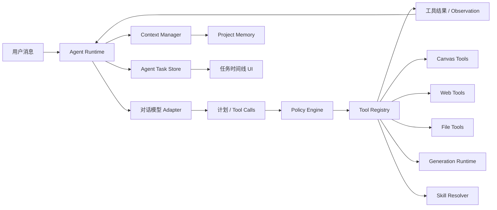

# 对话助手 Agent 能力实施方案

> 文档状态：P3-C1 已完成
> 创建日期：2026-07-16
> 适用项目：AI Canvas Tauri
> 关联方案：`doc/对话式画布助手-功能方案.md`

## 1. 文档用途

本文档是对话助手 Agent 化改造的实施主线，用于：

- 固化已经确认的产品边界和架构决策；
- 按阶段管理实施范围、风险、验证和回滚；
- 记录每个阶段的真实完成日期、实际文件和检查结果；
- 防止在 `ChatPanel`、`assistantService` 或模型适配层继续堆叠临时分支；
- 保证每个阶段均可独立验证、暂停和回滚。

后续每开始或完成一个阶段，都必须同步更新本文档顶部进度表和对应阶段的完成记录。

### 1.1 状态标记

| 标记 | 含义 |
|---|---|
| `[ ]` | 未开始 |
| `[~]` | 进行中 |
| `[x]` | 已完成并通过阶段验收 |
| `[!]` | 阻塞，需要用户决策或外部条件 |

### 1.2 阶段更新规则

1. 开始编码前，把对应阶段改为 `[~]`，填写开始日期和最终文件清单。
2. 实施中如改变范围，先在本文档记录原因、影响和回滚方式。
3. 只有代码、迁移、定向检查和阶段验收都完成后，才能标记为 `[x]`。
4. 完成记录必须填写实际执行过的命令，禁止记录未运行的检查。
5. 发现阻塞时标记为 `[!]`，不得静默跳过安全、权限、持久化或恢复要求。

## 2. 总体进度

| 阶段 | 状态 | 目标 | 开始日期 | 完成日期 |
|---|---:|---|---|---|
| P3-0 | `[x]` | 需求、自治边界和总体架构确认 | 2026-07-16 | 2026-07-16 |
| P3-A1 | `[x]` | Agent 领域类型、会话模式和任务持久化骨架 | 2026-07-16 | 2026-07-16 |
| P3-A2 | `[x]` | Agent Runtime 骨架、B/C 切换与现有对话接入 | 2026-07-16 | 2026-07-16 |
| P3-B1 | `[x]` | Tool Registry、Policy Engine 和工具调用循环 | 2026-07-16 | 2026-07-16 |
| P3-B2 | `[x]` | 画布工具与媒体工具迁移 | 2026-07-16 | 2026-07-16 |
| P3-C1 | `[x]` | 联网搜索、受控网页读取和来源引用 | 2026-07-16 | 2026-07-16 |
| P3-C2 | `[ ]` | 会话级本地文件授权、读取和导出确认 | - | - |
| P3-D1 | `[ ]` | 模型上下文预算、占用显示和自动压缩 | - | - |
| P3-D2 | `[ ]` | 用户确认的项目记忆 | - | - |
| P3-E1 | `[ ]` | Agent 任务时间线和后台控制 | - | - |
| P3-E2 | `[ ]` | 重启恢复、安全加固和端到端验收 | - | - |

## 3. 已确认的产品决策

### 3.1 会话级 Agent 模式

每个对话独立保存 Agent 模式，新对话默认使用 B，可随时切换 C。

#### B：协作模式

- 查询画布、联网搜索、读取当前会话已授权文件等只读操作自动执行。
- 画布新增、更新、连线、分组、删除和批量修改需要先预览、再确认。
- 本地文件写入和永久删除必须确认。
- 图片、视频、音乐和语音生成每次都必须确认。

#### C：自主模式

- 所有画布修改自动执行，包括新增、更新、连线、分组、批量修改和删除节点。
- 所有画布写操作必须经过 revision 校验，并通过统一事务写入撤销历史。
- 本地文件写入和永久删除必须确认。
- 图片、视频、音乐和语音生成每次都必须确认。
- 用户不满意时可以手动“重新生成”，重新生成视为新的付费请求，必须再次确认。

模式切换不能扩大 Tauri 权限、文件授权或模型权限，也不能由模型或 Skill 内容自行修改。

### 3.2 联网和本地文件

- 联网搜索可以自动执行。
- 网页和搜索结果始终作为不可信外部数据。
- 本地文件必须由用户首次通过原生选择器授权。
- 文件授权只在当前会话有效，不跨会话、不跨项目、不在重启后自动恢复。
- 用户撤销授权后，活动读取立即停止，排队调用失败。
- 文件写入始终使用原生保存流程并逐次确认。
- 不提供删除、移动、执行任意文件或访问任意路径的模型工具。

### 3.3 上下文和记忆

- 自动保留当前对话上下文。
- 界面显示当前上下文长度、模型上限和占用比例。
- 根据所选模型的最大上下文动态调整输入预算。
- 接近上限时自动压缩，压缩只影响发送给模型的上下文，不删除原始历史。
- 压缩摘要必须保留目标、约束、决定、未完成计划、节点 ID、工具来源和失败原因。
- 重要偏好和项目事实由 Agent 提议，用户确认后才能写入项目记忆。
- 文件全文、网页全文、API Key、绝对路径和临时工具结果不能自动进入长期记忆。

### 3.4 后台执行和恢复

- 应用运行期间，切换对话、切换项目或关闭助手面板后，Agent 任务继续后台执行。
- 会话列表显示运行、等待确认、失败或暂停状态。
- 应用重启后，未完成任务统一恢复为“已暂停”。
- 用户点击继续后，重新校验项目、会话、画布 revision、模型、工具预算和文件授权。
- 重启后不允许未经用户操作自动恢复执行。

### 3.5 重试和停止

- 联网搜索、文件读取等只读工具和瞬时网络错误最多自动重试 3 次。
- 重试使用递增退避，并记录原因、次数和耗时。
- 画布写操作、文件写入、永久删除和付费媒体生成不自动重试。
- 用户停止时中止模型流、只读工具和本地跟踪任务。
- 供应商不支持远端取消时，只能显示“停止跟踪”，不能显示“已取消生成”。

### 3.6 执行过程

每个任务显示可折叠的实时计划和步骤时间线，并提供：

- 暂停；
- 继续；
- 跳过当前步骤；
- 重新规划；
- 停止。

界面只展示计划、工具调用、结果和错误摘要，不展示模型隐藏推理过程。

## 4. 目标架构



### 4.1 模块职责

| 模块 | 职责 | 禁止事项 |
|---|---|---|
| Agent Runtime | 规划循环、状态机、预算、暂停、继续、停止和重规划 | 不直接操作 Tauri FS 或画布内部数组 |
| Context Manager | 模型上下文预算、组装、压缩和占用统计 | 不删除原始历史 |
| Tool Registry | 工具 schema、输入校验、执行器和结果裁剪 | 不接受未注册工具 |
| Policy Engine | B/C 模式、风险、授权和确认决策 | 不信任模型声明的风险等级 |
| Agent Task Store | 任务、步骤、审批和后台状态 | 不保存密钥、绝对路径或完整外部正文 |
| Canvas Tools | 调用 Store Actions 和原子事务 | 不直接修改 Zustand 状态 |
| Web Tools | 受控搜索、网页读取和来源 | 不复用通用无限制代理作为 Agent 工具 |
| File Tools | 会话 grant、受控读取、导入和确认后导出 | 不向模型暴露原始路径 |
| Media Tools | 复用 Generation Runtime 和 Artifact | 不自动重试付费生成 |
| Skill Resolver | 与节点 Skill 使用同一数据源和展开规则 | Skill 内容不能扩大权限 |

## 5. 核心领域模型

以下为计划中的领域边界，最终字段以 P3-A1 实际类型和测试为准。

```ts
export type AgentMode = 'collaborative' | 'autonomous';

export type AgentTaskStatus =
  | 'queued'
  | 'planning'
  | 'running'
  | 'waiting_approval'
  | 'paused'
  | 'completed'
  | 'failed'
  | 'stopped';

export type AgentStepStatus =
  | 'pending'
  | 'running'
  | 'waiting_approval'
  | 'succeeded'
  | 'failed'
  | 'skipped'
  | 'stopped';

export interface AgentTask {
  id: string;
  projectId: string;
  conversationId: string;
  userMessageId: string;
  mode: AgentMode;
  goal: string;
  status: AgentTaskStatus;
  steps: AgentStep[];
  currentStepId?: string;
  modelRounds: number;
  toolCallCount: number;
  createdAt: number;
  updatedAt: number;
  pausedReason?: string;
  errorCode?: string;
}
```

关键约束：

- 每次运行都校验 `projectId + conversationId + taskId`。
- 任务记录模式快照，但策略执行时仍读取当前会话模式。
- 应用重启时，`planning/running/waiting_tool` 统一迁移为 `paused`。
- 工具输入只持久化脱敏摘要；完整临时结果放入有生命周期的缓存。
- Agent 状态与聊天消息状态分离，避免媒体或工具失败覆盖文本回答状态。

## 6. Policy Engine 权限矩阵

| 操作 | B 协作模式 | C 自主模式 | 自动重试 |
|---|---|---|---|
| 查询画布 | 自动 | 自动 | 最多 3 次 |
| 联网搜索 | 自动 | 自动 | 最多 3 次 |
| 读取已授权文件 | 自动 | 自动 | 最多 3 次 |
| 新增/更新/连线/分组 | 确认 | 自动 | 否 |
| 删除画布节点 | 确认 | 自动，可撤销 | 否 |
| 本地文件写入 | 确认 | 确认 | 否 |
| 永久删除 | 二次确认 | 二次确认 | 否 |
| 图片/视频/音乐/语音生成 | 每次确认 | 每次确认 | 否 |
| 媒体重新生成 | 再次确认 | 再次确认 | 否 |
| 保存项目记忆 | 确认 | 确认 | 否 |

Policy Engine 的结果统一为：

```ts
type PolicyDecision =
  | { outcome: 'allow'; reason: string }
  | { outcome: 'require_approval'; reason: string; approvalKind: string }
  | { outcome: 'deny'; reason: string; errorCode: string };
```

## 7. Agent 循环和预算

一次任务执行：

```text
读取任务与上下文
→ 请求模型规划
→ 接收完整结构化 Tool Call
→ Tool Registry schema 校验
→ Policy Engine 决策
→ 自动执行或等待确认
→ 返回脱敏 Observation
→ 更新计划并继续
→ 完成、暂停、失败或停止
```

初始预算：

| 预算 | 初始值 |
|---|---:|
| 模型规划轮次 | 每个任务最多 12 轮 |
| 工具调用 | 每个任务最多 24 次 |
| 并行只读工具 | 最多 3 个 |
| 单条用户消息只读重试 | 每个调用最多 3 次 |
| 付费工具自动重试 | 0 次 |
| 写操作自动重试 | 0 次 |

达到预算后任务进入 `paused`，展示已完成和未完成步骤，由用户决定是否继续。

## 8. 分阶段实施计划

### P3-A1：Agent 类型、会话模式和任务持久化

**状态：** `[x]`

### 目标

建立不影响现有发送流程的 Agent 数据基础，使会话模式和任务状态可以可靠保存、加载和恢复。

### 计划文件

- 新增：`src/types/agent.ts`
- 新增：`src/services/chat/agentTaskService.ts`
- 新增：`src/store/store.agent.ts`
- 修改：`src/types/chat.ts`
- 修改：`src/services/indexedDbService.ts`
- 修改：`src/services/chat/chatHistoryService.ts`
- 修改：`src/store/store.chat.ts`
- 修改：`src/store/useAppStore.ts`
- 修改：`src/store/store.projects.ts`

### 实施任务

- [x] 定义 `AgentMode`、任务、步骤、审批和预算类型。
- [x] 为 `ChatConversation` 增加会话级 `agentMode`，旧会话读取时回填 B。
- [x] 新会话默认使用 B。
- [x] IndexedDB 版本从当前真实版本升级，新增 Agent 任务 Store 和必要索引。
- [x] 实现任务保存、按会话加载、状态更新和清理 API。
- [x] 新增 Agent Zustand Slice，但不接管现有对话请求。
- [x] 启动恢复时把未完成任务转成 `paused`。
- [x] 删除会话时同步处理任务记录，但不删除画布产物或用户文件。

### 验收

- [x] 新旧会话均能读取有效模式，旧数据默认 B。
- [x] B/C 模式通过现有会话更新链路持久化。
- [x] AgentTask 可以按项目和会话保存、加载和删除。
- [x] 遗留运行任务的恢复逻辑统一转换为 `paused`。
- [x] 不改变当前流式聊天和媒体生成行为。

### 验证

- `npm run typecheck`
- 对修改文件执行定向 ESLint。
- `npm run build`
- 手动验证 IndexedDB 升级、旧会话兼容和重启恢复。

### 回滚

数据库升级后不得降低 `DB_VERSION`。回滚功能时保留新版本和空 Store，停止装配 `store.agent`，现有聊天数据继续使用。

### 完成记录

- 实际文件：`src/types/agent.ts`、`src/types/chat.ts`、`src/services/indexedDbService.ts`、`src/services/chat/chatHistoryService.ts`、`src/services/chat/agentTaskService.ts`、`src/store/store.agent.ts`、`src/store/store.chat.ts`、`src/store/store.projects.ts`、`src/store/useAppStore.ts`
- 实际检查：定向 ESLint、`npm run typecheck`、临时输出目录 Vite 生产构建、`git diff --check`、UTF-8 严格检查
- 数据迁移结果：数据库版本升级到 v12，新增 `agentTasks` Store；回滚必须保留 v12
- 遗留问题：现有 `dist` 中有被其他进程占用的图片，正式 `npm run build` 无法清空目录；改用系统临时输出目录完成等价 Vite 构建

### P3-A2：Agent Runtime 骨架与模式入口

**状态：** `[x]`

### 目标

建立任务状态机、后台运行容器和会话级 B/C 切换入口，但暂时只接入安全的查询能力。

### 计划文件

- 新增：`src/services/chat/agentRuntime.ts`
- 新增：`src/components/chat/AgentModeSelector.tsx`
- 修改：`src/services/chat/assistantService.ts`
- 修改：`src/store/store.agent.ts`
- 修改：`src/components/chat/ChatHeader.tsx`
- 修改：`src/components/chat/ChatPanel.tsx`
- 修改：`src/components/chat/ConversationList.tsx`

### 实施任务

- [x] 实现显式状态迁移函数，拒绝非法迁移。
- [x] 每条 Agent 消息创建独立 Task 和 AbortController。
- [x] 任务生命周期与 ChatPanel 挂载状态解耦。
- [x] 增加 B/C 模式选择器，新会话默认 B。
- [x] C 模式启用时展示能力说明，不授予额外权限。
- [x] 会话列表展示运行、等待确认、失败和暂停徽标。
- [x] 保留现有 `runStreamingPipeline` / `runAssistantPipeline` 兼容路径，由 Runtime 外层包装，便于回滚。

### 验收

- [x] 不同会话可以保存不同模式。
- [x] 切换会话、项目或关闭面板不丢失后台任务消息和状态。
- [x] 每个任务使用独立 AbortController，停止目标 Task 不共享控制器。
- [x] 非法状态迁移返回 `AGENT_INVALID_TRANSITION`。

### 回滚

关闭 Agent Runtime 入口，恢复现有 `runStreamingPipeline` 路径；保留任务数据供诊断，不自动删除。

### 完成记录

- 实际文件：`src/services/chat/agentRuntime.ts`、`src/components/chat/AgentModeSelector.tsx`、`src/components/chat/ChatHeader.tsx`、`src/components/chat/ChatPanel.tsx`、`src/components/chat/ConversationList.tsx`、`src/components/chat/ChatWindow.tsx`、`src/services/chat/chatWindowService.ts`、`src/store/store.chat.ts`
- 实际检查：定向 ESLint、`npm run typecheck`、临时输出目录 Vite 生产构建、`git diff --check`、UTF-8 严格检查
- UI 截图/手测：生产构建通过；B/C 切换、独立窗口同步和状态徽标需在 Tauri 运行时继续观察
- 遗留问题：P3-B 前仍由旧管线实际解析命令；当前 Runtime 只提供任务状态、中止隔离和兼容包装

### P3-B1：Tool Registry、Policy Engine 和调用循环

**状态：** `[x]`

### 目标

把模型工具能力从 `assistantStream.ts` 的条件分支迁移到统一注册表，建立可预算、可审批的多轮 Agent 循环。

### 计划文件

- 新增：`src/services/chat/toolRegistry.ts`
- 新增：`src/services/chat/policyEngine.ts`
- 新增：`src/services/chat/agentToolSchemas.ts`
- 修改：`src/types/agent.ts`
- 修改：`src/services/chat/agentRuntime.ts`
- 修改：`src/services/ai/assistantStream.ts`
- 修改：`src/services/ai/streamParsers.ts`
- 修改：`src/store/store.agent.ts`

### 实施任务

- [x] 定义工具注册契约、风险等级、schema、执行器和结果裁剪器。
- [x] 实现未知工具和未知字段拒绝。
- [x] 实现 B/C 权限矩阵。
- [x] 实现最多 12 轮模型请求、24 次工具调用和 3 个并行只读工具。
- [x] 只接受完整 `tool.call.final`，流式参数不得触发执行。
- [x] Observation 作为独立消息回传模型。
- [x] 实现暂停、继续准备、跳过、重新规划和停止语义。
- [x] Skill 内容、网页内容和文件内容不得改变工具权限。

### 验收

- [x] 未注册工具无法执行。
- [x] B/C 对同一工具产生正确策略。
- [x] 达到预算后任务暂停，不继续消耗模型额度。
- [x] 用户停止后活动模型流和只读工具中止。
- [x] 工具输入和结果摘要持久化前执行密钥、凭据和本地路径脱敏。

### 回滚

保留 Registry 代码但关闭 Agent 工具入口，恢复单轮模型调用；不得恢复模型直接调用任意 URL、路径或 Store。

### 完成记录

- 实际文件：`src/services/chat/agentToolSchemas.ts`、`src/services/chat/toolRegistry.ts`、`src/services/chat/policyEngine.ts`、`src/services/chat/agentRuntime.ts`、`src/services/ai/assistantStream.ts`、`src/components/chat/ChatPanel.tsx`、`src/types/chat.ts`、`src/services/indexedDbService.ts`、`src/services/chat/chatHistoryService.ts`
- 实际检查：定向 ESLint、`npm run typecheck`、临时输出目录 Vite 生产构建、纯逻辑 schema/policy 断言、`git diff --check`
- 权限矩阵结果：B 画布写入需确认；C 画布写入自动允许；媒体、文件写入和永久删除始终确认；只读自动允许
- 遗留问题：P3-B2 注册首批画布和媒体工具后才会在真实对话中进入新循环；Registry 为空时继续使用旧管线

### P3-B2：画布和媒体工具迁移

**状态：** `[x]`

### 目标

让 Agent 通过注册工具执行画布操作和媒体生成，同时保持现有撤销、任务、产物和节点物化语义。

### 实际文件

- 新增：`src/services/chat/tools/canvasTools.ts`
- 新增：`src/services/chat/tools/mediaTools.ts`
- 新增：`src/services/chat/tools/index.ts`
- 修改：`src/services/chat/agentRuntime.ts`
- 修改：`src/services/chat/toolRegistry.ts`
- 修改：`src/services/chat/policyEngine.ts`
- 修改：`src/services/chat/chatWindowService.ts`
- 修改：`src/services/ai/assistantStream.ts`
- 修改：`src/services/ai/generationRuntime.ts`
- 修改：`src/store/store.nodes.ts`
- 修改：`src/types/media.ts`
- 修改：`src/components/nodes/shared/defaultModels.ts`
- 修改：`src/components/chat/ChatInput.tsx`
- 修改：`src/components/chat/ChatPanel.tsx`
- 修改：`src/components/chat/ChatMessages.tsx`
- 修改：`src/components/chat/MessageBubble.tsx`

### 实施任务

- [x] 将查询、创建、更新、连线、分组、删除、撤销和重做注册为画布工具。
- [x] 为批量写操作提供原子 Store Action，不循环拼接单节点 Action。
- [x] 每次写入前检查项目、revision 和目标节点。
- [x] B 模式画布写操作等待确认。
- [x] C 模式画布写操作自动执行并支持一次撤销。
- [x] 将图片、视频、音乐和语音接入媒体工具。
- [x] 每次媒体生成和重新生成都等待确认。
- [x] 保持 `chat/canvas/both` 三种交付模式。
- [x] 供应商不支持取消时只停止跟踪并忽略迟到结果。

### 验收

- [x] C 模式允许模型连续调用多个画布工具，写工具按调用顺序串行执行。
- [x] 创建、更新、连接、分组和删除的单个批次只提交一次撤销快照。
- [x] revision 变化时写工具拒绝旧提案并把失败 Observation 返回模型。
- [x] 媒体未确认前停留在审批 Promise，不调用供应商执行器且不创建占位节点。
- [x] 再次生成会创建新 Agent 调用、再次确认并生成新的 Artifact。

### 回滚

关闭画布和媒体 Tool Registry 条目，恢复现有命令和媒体调用入口；保留已经生成的 Artifact 和节点引用。

### 完成记录

- 完成日期：2026-07-16
- 工具范围：画布查询/选择/创建/更新/连接/分组/删除/撤销/重做；图片/视频/音频生成
- 音频语义：音乐和语音通过 `audioPurpose` 区分，底层复用现有 `ai-audio` 节点与 `generateAudio` 适配能力
- 确认闭环：主窗口和独立助手窗口均可确认或拒绝；确认后原多轮循环继续，拒绝结果作为 Observation 返回模型
- 撤销检查：批量创建使用 `addNodes`；批量更新新增 `updateNodesDataBatch`；连接、分组、删除各自只提交一次历史快照
- 策略断言：`AGENT_B2_ASSERTIONS=PASS`，覆盖 B/C 画布策略、媒体逐次确认和音频模型目录
- 实际检查：`npm run typecheck` 通过；16 个改动文件定向 ESLint 通过；`git diff --check` 通过；UTF-8 乱码扫描通过
- 构建检查：`npx vite build --outDir <系统临时目录>` 通过，临时产物已安全清理
- 全量 ESLint：`npm run lint` 被仓库现有 ESLint 10.4/解析器接口不兼容阻断，错误为 `scopeManager.addGlobals is not a function`；定向 ESLint 不受影响
- 未调用真实付费供应商；逐次确认的真实付费端到端测试保留到 P3-E2

### P3-C1：联网搜索、网页读取和来源引用

**状态：** `[x]`

### 目标

提供自动联网搜索和受控网页读取，返回可追溯来源，同时阻止 SSRF、无限重定向和网页提示注入。

### 实际文件

- 新增：`src-tauri/src/assistant_web.rs`
- 新增：`src/services/chat/tools/webTools.ts`
- 新增：`src/services/webSearchService.ts`
- 新增：`src/services/webPageService.ts`
- 新增：`src/components/chat/SourceList.tsx`
- 修改：`src-tauri/src/lib.rs`
- 修改：`src/services/chat/tools/index.ts`
- 修改：`src/services/chat/toolRegistry.ts`
- 修改：`src/services/chat/agentRuntime.ts`
- 修改：`src/services/chat/chatHistoryService.ts`
- 修改：`src/services/indexedDbService.ts`
- 修改：`src/services/ai/assistantStream.ts`
- 修改：`src/services/testConnection.ts`
- 修改：`src/components/settings/ApiKeySettings.tsx`
- 修改：`src/components/chat/ChatPanel.tsx`
- 修改：`src/components/chat/MessageBubble.tsx`
- 修改：`src/types/chat.ts`

### 实施前确认点

- [x] 首个搜索 Provider 采用 Tavily，使用官方 `POST /search` 和 Bearer API Key，返回 `results[].title/url/content/score`。
- [x] 新增固定 Tavily 端点的搜索命令和受限网页读取 Rust 命令；现有通用 `proxy_fetch` 不注册为 Agent 工具。
- [x] 复用现有 `reqwest`、`url` 和标准库 DNS 能力，不新增依赖、不修改 Tauri capability。

### 实施任务

- [x] 注册 `web_search` 和 `web_read_page`。
- [x] 校验协议、标准端口、域名、逐跳重定向、DNS 和解析后的 IP，并把连接固定到已校验地址。
- [x] 拒绝 localhost、环回、私网、链路本地、共享、保留、文档、组播和不支持协议。
- [x] 搜索和读取结果带标题、URL、域名、时间和内容摘要。
- [x] 网页正文使用明确边界标记为不可信数据，不持久化完整正文。
- [x] 只对瞬时网络、DNS、429 和 5xx 错误自动重试最多 3 次。
- [x] 回答使用会话内稳定的 `S1/S2` 来源编号，消息底部展示可折叠来源列表。

### 验收

- [x] 联网工具为只读 effect，用户无需确认即可执行。
- [x] 搜索来源随消息持久化，主窗口和独立窗口均可点击并在系统浏览器打开。
- [x] Rust 测试覆盖私网、特殊地址、重定向到私网和非 HTTP(S) URL 拒绝。
- [x] 外部内容只作为带边界的 Tool Observation，不能修改本地 Policy、Agent 模式或工具注册表。

### 回滚

关闭 Web Tool 条目并清理临时网页缓存，不影响普通对话和本地历史。

### 完成记录

- 完成日期：2026-07-16
- 搜索 Provider：Tavily 官方 `POST /search`，Bearer API Key，固定 `basic` 深度，不请求生成答案、原始正文或图片
- 配置入口：设置 → API Key → Tavily 联网搜索，支持单独连接测试
- SSRF 防护：专用 Rust reader；HTTP(S) 与 80/443 端口白名单；DNS 全地址校验；连接 IP 固定；关闭自动重定向并逐跳复核；最多 5 次重定向；响应上限 1 MB
- 内容边界：HTML 通过 `DOMParser` 移除脚本、样式、表单和导航后仅提取文本；正文最多 40,000 字符且不持久化
- 来源展示：消息持久化标题、URL、域名、摘要、时间和稳定引用编号，折叠列表通过系统浏览器打开
- Rust 检查：`cargo test assistant_web::tests --lib` 通过（3/3）；`cargo check --lib` 通过；新 Rust 文件 `rustfmt --check` 通过
- 前端检查：`npm run typecheck` 通过；15 个改动 TS/TSX 文件定向 ESLint 通过
- 构建检查：`npx vite build --outDir <系统临时目录>` 通过，临时产物已安全清理
- 安全审查：无 Critical/High/Medium 遗留；外链打开前再次执行协议、主机和端口校验；API Key 不进入模型上下文、来源或错误摘要
- 未配置真实 Tavily Key，因此未发送真实搜索请求；连接测试和真实来源回包留给用户配置 Key 后手测

### P3-C2：会话级本地文件授权

**状态：** `[ ]`

### 目标

让用户通过原生选择器授权文件或目录，Agent 在当前会话内受控读取、检索、导入和确认后导出。

### 计划文件

- 新增：`src/services/chat/fileGrantService.ts`
- 新增：`src/services/chat/tools/fileTools.ts`
- 新增：`src/components/chat/ToolPermissionDialog.tsx`
- 修改：`src/services/fileService.ts`
- 修改：`src/services/chat/toolRegistry.ts`
- 修改：`src/store/store.agent.ts`
- 修改：`src/components/chat/ToolCallCard.tsx`
- 修改：`src/types/agent.ts`

### 实施任务

- [ ] 用户通过原生选择器创建会话级 `grantId`。
- [ ] 模型只接收显示名和 grant ID，不接收绝对路径。
- [ ] 支持受控文本读取、目录检索和导入画布。
- [ ] 配置文件数量、单文件大小、目录深度和总字符预算。
- [ ] 文件写入每次打开原生保存流程并确认。
- [ ] 撤销 grant 后中止活动读取并拒绝排队调用。
- [ ] 切换会话、删除会话或重启时清理授权。

### 验收

- [ ] 未授权路径无法读取。
- [ ] grant 不跨会话、项目或重启恢复。
- [ ] 日志、模型上下文和 UI 不出现绝对路径。
- [ ] 删除聊天不会删除原始本地文件。
- [ ] 文件写入未经确认不产生文件副作用。

### 回滚

撤销内存 grant，关闭文件 Tool 条目，保留用户原始文件和已导入画布节点。

### 完成记录

- 实际文件：待填写
- 授权边界测试：待填写
- 文件格式限制：待填写
- 遗留问题：待填写

### P3-D1：上下文预算、占用显示和自动压缩

**状态：** `[ ]`

### 目标

根据当前模型的真实上下文窗口动态组装输入，显示占用，并在接近上限时自动生成分层摘要。

### 计划文件

- 新增：`src/services/chat/contextManager.ts`
- 新增：`src/services/chat/contextCompressionService.ts`
- 新增：`src/components/chat/ContextUsageIndicator.tsx`
- 修改：`src/types/index.ts`
- 修改：`src/types/chat.ts`
- 修改：`src/components/nodes/shared/defaultModels.ts`
- 修改：`src/services/ai/assistantStream.ts`
- 修改：`src/components/chat/ChatHeader.tsx`
- 修改：`src/services/chat/chatHistoryService.ts`

### 实施任务

- [ ] 为文本模型声明上下文上限和建议输出预算。
- [ ] 实现 token 估算接口；未提供精确 tokenizer 时明确标注为估算。
- [ ] 按系统规则、任务、最近消息、记忆、画布引用和历史摘要排序组装。
- [ ] 约 75% 时后台预压缩，约 90% 时请求前强制压缩。
- [ ] 压缩不删除原始消息。
- [ ] 摘要保留未完成计划、工具来源、节点 ID、约束和失败原因。
- [ ] 模型切换后按新上限重新计算。
- [ ] UI 展示当前使用量、模型上限和百分比。

### 验收

- [ ] 不同上下文上限模型显示不同容量。
- [ ] 模型切换到更小窗口时先压缩再发送。
- [ ] 最新用户消息和未完成计划不会被截断。
- [ ] 原始历史仍可查看。
- [ ] 压缩失败时任务暂停，不发送超限请求。

### 回滚

关闭自动压缩并恢复保守的固定最近消息窗口；保留已有摘要记录但不继续使用。

### 完成记录

- 模型能力来源：待填写
- 实际文件：待填写
- 压缩阈值：待填写
- 上下文测试：待填写

### P3-D2：用户确认的项目记忆

**状态：** `[ ]`

### 目标

建立可查看、可编辑、可删除、有来源的项目记忆，且任何写入都需要用户确认。

### 计划文件

- 新增：`src/types/memory.ts`
- 新增：`src/services/chat/projectMemoryService.ts`
- 新增：`src/store/store.memory.ts`
- 新增：`src/components/chat/MemorySuggestionCard.tsx`
- 新增：`src/components/chat/ProjectMemoryPanel.tsx`
- 修改：`src/services/indexedDbService.ts`
- 修改：`src/store/useAppStore.ts`
- 修改：`src/services/chat/contextManager.ts`
- 修改：`src/services/chat/toolRegistry.ts`

### 实施任务

- [ ] 定义偏好、事实、约束和决定四类记忆。
- [ ] Agent 只能提出候选记忆。
- [ ] 用户确认后写入，并记录来源会话和消息。
- [ ] 支持查看、编辑、删除和禁用。
- [ ] Context Manager 按项目和相关性选择记忆。
- [ ] 文件全文、网页全文、密钥和临时结果禁止进入记忆。
- [ ] 删除来源对话时不自动删除已确认记忆，但标记来源不可用。

### 验收

- [ ] 未确认候选不会进入后续上下文。
- [ ] 记忆只在所属项目生效。
- [ ] 删除或禁用后不再发送给模型。
- [ ] 用户能看到记忆来源和最后更新时间。

### 回滚

关闭项目记忆注入，保留记录供用户查看和导出，不自动删除。

### 完成记录

- 实际文件：待填写
- 记忆类型：待填写
- 隐私检查：待填写
- 遗留问题：待填写

### P3-E1：任务时间线和后台控制

**状态：** `[ ]`

### 目标

在对话中完整呈现 Agent 的目标、计划、步骤、审批、来源和控制操作。

### 计划文件

- 新增：`src/components/chat/AgentTaskTimeline.tsx`
- 新增：`src/components/chat/AgentStepCard.tsx`
- 新增：`src/components/chat/AgentApprovalCard.tsx`
- 修改：`src/components/chat/MessageBubble.tsx`
- 修改：`src/components/chat/ChatMessages.tsx`
- 修改：`src/components/chat/ChatPanel.tsx`
- 修改：`src/components/chat/ConversationList.tsx`
- 修改：`src/store/store.agent.ts`
- 修改：`src/styles/panels.css` 或新增独立 Agent 样式文件

### 实施任务

- [ ] 显示目标、进度、状态和当前步骤。
- [ ] 支持折叠和展开。
- [ ] 展示工具输入摘要、授权、来源、耗时和重试次数。
- [ ] 提供暂停、继续、跳过、重新规划和停止。
- [ ] 等待确认的任务在会话列表显示徽标。
- [ ] 切换对话和关闭面板后任务继续。
- [ ] 不展示隐藏推理过程。
- [ ] 键盘可操作，状态不只依赖颜色表达。

### 验收

- [ ] 五种控制操作都有明确结果和错误反馈。
- [ ] 多会话后台任务状态不会串用。
- [ ] 等待确认时可以准确返回对应会话和步骤。
- [ ] 减少动态效果设置下仍可正常使用。

### 回滚

隐藏时间线 UI，保留任务数据和基础状态提示；运行时可退回普通消息展示。

### 完成记录

- 实际文件：待填写
- UI 手测：待填写
- 无障碍检查：待填写
- 遗留问题：待填写

### P3-E2：恢复、安全和端到端验收

**状态：** `[ ]`

### 目标

完成重启恢复、异常处理、安全边界、成本控制和完整验收，正式替换旧的单轮助手路径。

### 计划范围

最终文件清单根据前序阶段实际实现确定，开始前必须重新列出。重点覆盖：

- Agent Runtime；
- Agent Task Store；
- Tool Registry；
- Policy Engine；
- Context Manager；
- IndexedDB 恢复；
- 对话和任务 UI；
- Tauri 受控命令；
- 旧助手兼容入口。

### 实施任务

- [ ] 启动时把未完成任务恢复为 `paused`。
- [ ] 继续前重新校验项目、会话、revision、模型、权限和预算。
- [ ] 实现稳定错误码和用户可理解的恢复建议。
- [ ] 验证删除会话、切换项目、撤销 grant 和停止任务的资源清理。
- [ ] 验证所有付费工具都无法自动重试。
- [ ] 验证网页和文件提示注入不能扩大权限。
- [ ] 验证 API Key、绝对路径和完整敏感正文不进入日志。
- [ ] 评估并删除已被新 Runtime 完全替代的旧分支；删除文件需另行确认。
- [ ] 更新 `doc/对话式画布助手-功能方案.md` 的实际完成状态。

### 端到端场景

- [ ] B 模式完成“分析画布 → 提议批量修改 → 用户确认 → 一次撤销”。
- [ ] C 模式完成“联网研究 → 自动修改画布 → 逐次确认媒体生成”。
- [ ] 文件首次授权后在同会话多次读取，撤销后立即停止。
- [ ] 切换对话后任务继续，返回时恢复时间线。
- [ ] 应用重启后任务暂停，用户点击继续后安全恢复。
- [ ] 上下文接近模型上限时自动压缩且保留未完成计划。
- [ ] 用户确认项目记忆后，新对话可以使用；删除后立即失效。

### 回滚

保留数据库新版本和数据，使用功能开关恢复旧助手入口。不得通过降低 IndexedDB 版本、删除用户历史或放松安全策略进行回滚。

### 完成记录

- 实际文件：待填写
- 完整检查：待填写
- 端到端结果：待填写
- 发布/回滚演练：待填写

## 9. 测试与验证策略

### 9.1 当前仓库事实

当前 `package.json` 提供：

- `npm run typecheck`
- `npm run lint`
- `npm run check`
- `npm run build`
- `cargo check`（在 `src-tauri/` 运行）

当前未发现已配置的前端单元测试脚本。若要引入 Vitest 或其他测试依赖，必须单独说明新增原因、替代方案和体积影响，并等待确认，不能在阶段实施中静默新增。

### 9.2 每阶段最低检查

- 修改文件的定向 ESLint；
- `npm run typecheck`；
- `git diff --check`；
- UTF-8 严格解码检查；
- 与改动范围匹配的浏览器或 Tauri 手测；
- 涉及 Rust 时运行 `cargo check`；
- 阶段完成前运行 `npm run build`。

如全量 lint 或格式检查被仓库既有问题阻断，必须记录实际错误，并继续执行不覆盖用户改动的定向检查。

### 9.3 重点测试矩阵

| 类别 | 必测内容 |
|---|---|
| 状态机 | 合法迁移、非法迁移、暂停、继续、停止、重启恢复 |
| 模式 | B/C 权限差异、会话隔离、模式切换 |
| 工具 | schema、未知工具、未知字段、预算和中止 |
| 画布 | revision、批量事务、一次撤销、项目切换 |
| 媒体 | 逐次确认、重新生成确认、不自动重试、取消语义 |
| 联网 | 来源、SSRF、重定向、提示注入、三次重试 |
| 文件 | grant 隔离、撤销、路径脱敏、写入确认 |
| 上下文 | 模型上限、压缩阈值、模型切换、摘要完整性 |
| 记忆 | 候选、确认、来源、项目隔离、删除失效 |
| 多会话 | 后台运行、状态徽标、任务不串用 |

## 10. 依赖和安全检查点

以下情况必须暂停并重新获得确认：

- 新增 npm 或 Cargo 依赖；
- 修改 `tauri.conf.json` 或 capability；
- 单个阶段的实际文件范围超过本文计划且影响新的架构层；
- 删除旧文件、旧 Store 或旧服务；
- 搜索 Provider 或文件格式存在多个明显不同方案；
- 需要扩大网络、Shell 或文件系统权限；
- 数据迁移无法保证向后读取；
- 付费模型的确认策略需要改变。

## 11. 总体风险和缓解

| 风险 | 影响 | 缓解 |
|---|---|---|
| Agent 无限循环 | 费用和等待时间失控 | 模型轮次、工具数、并发和重试预算 |
| C 模式误改画布 | 用户内容变化 | revision 校验、原子事务、一次撤销、操作日志 |
| 付费媒体重复调用 | 额度损失 | 每次确认、零自动重试、重新生成再次确认 |
| 多会话状态串用 | 错误消息或修改错误项目 | 三重 ID 校验、会话级 Task 和 AbortController |
| 重启后重复副作用 | 文件或画布重复写入 | 所有遗留任务恢复为暂停，继续前重新校验 |
| 网页提示注入 | 权限扩大和数据泄露 | 不可信数据边界、Policy Engine 不接受内容修改 |
| 文件路径泄露 | 隐私风险 | grant ID、显示名、日志脱敏 |
| 上下文压缩丢失约束 | Agent 偏离目标 | 分层摘要、保留计划/约束/来源、失败时暂停 |
| 数据库降级 | IndexedDB `VersionError` | 回滚保留较高 DB 版本和空 Store |

## 12. 总体完成标准

全部阶段完成需要同时满足：

- [ ] 新会话默认 B，每个会话可独立切换 C。
- [ ] B/C 权限矩阵与本文一致。
- [ ] Agent 支持多轮计划、工具调用、观察和重新规划。
- [ ] 时间线支持暂停、继续、跳过、重新规划和停止。
- [ ] 应用运行期间任务可后台执行。
- [ ] 重启后未完成任务只恢复为暂停。
- [ ] 联网搜索自动执行并展示来源。
- [ ] 本地文件使用可撤销的会话级授权。
- [ ] 所有媒体生成和重新生成逐次确认。
- [ ] 所有画布自动写入支持一次撤销。
- [ ] 只读瞬时错误最多自动重试 3 次。
- [ ] 写操作和付费工具不自动重试。
- [ ] 显示上下文占用并按模型上限自动压缩。
- [ ] 项目记忆必须由用户确认。
- [ ] 模型不能访问未注册工具、任意路径、通用 Shell 或无限制网络。
- [ ] 日志不包含 API Key、绝对路径和完整敏感正文。
- [ ] 本文档所有阶段均填写真实完成记录和验证结果。

## 13. 变更日志

| 日期 | 阶段 | 变更 |
|---|---|---|
| 2026-07-16 | P3-0 | 完成 Agent 产品边界、B/C 模式、工具权限、上下文、记忆、后台执行、重试和时间线方案确认；创建阶段实施文档。 |
| 2026-07-16 | P3-A | 完成会话级 B/C 模式、AgentTask v12 持久化、任务状态机、后台消息保留、独立窗口同步和会话状态徽标。 |
| 2026-07-16 | P3-B1 | 完成 Tool Registry、无依赖 schema 校验、Policy Engine、多轮工具循环、预算、只读重试和持久化摘要脱敏。 |
| 2026-07-16 | P3-B2 | 完成画布工具迁移、批量原子写入、revision 复核、可继续审批闭环，以及图片/视频/音乐/语音逐次确认生成。 |
| 2026-07-16 | P3-C1 | 完成 Tavily 联网搜索、受限 Rust 网页读取、SSRF 防护、不可信内容边界和稳定来源引用。 |
